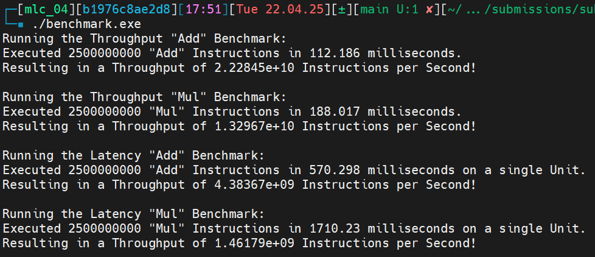

Base
====

In this chapter, we get more familiar with some base ARM64 assembly instructions and how to benchmark the performance of such instructions.

All files related to the tasks of this chapter can be found under ``submissions/base/``.

Copying Data
------------

First, we will implement the functionality of the given ``copy_c_0`` and ``copy_c_1`` C functions from the ``copy_c.c`` file using only base instructions.
The corresponding assembly code will be written in the ``copy_asm_0`` and ``copy_asm_1`` functions, located in the ``copy_asm.s`` file. 

1. copy_asm_0
^^^^^^^^^^^^^

**Task**: Implement the function ``copy_asm_0`` using only base instructions. The function should have the same functionality as its C counterpart.

.. code-block:: asm

        .text
        .type copy_asm_0, %function
        .global copy_asm_0
    copy_asm_0:
        ldp w2, w3, [x0]
        stp w2, w3, [x1]

        ldp w4, w5, [x0, #8]
        stp w4, w5, [x1, #8]
        
        ldp w6, w7, [x0, #16]
        stp w6, w7, [x1, #16]

        ldr w8, [x0, #24]
        str w8, [x1, #24]

        ret
        .size copy_asm_0, (. - copy_asm_0)

2. copy_asm_1
^^^^^^^^^^^^^

**Task**: Implement the function ``copy_asm_1`` using only base instructions. The function should have the same functionality as its C counterpart.

.. code-block:: asm

        .text
        .type copy_asm_1, %function
        .global copy_asm_1
    copy_asm_1:
        mov x3, #0  // counter

    start_loop:
        cmp x3, x0  // compare value in x3 and x0
        b.ge end_loop  // conditions: counter x3 greater equal n/x0 (value in [x0])

        ldr w4, [x1, x3, lsl #2]  // address = x1 + (x3 << 2)
        str w4, [x2, x3, lsl #2]  // x3 << 2 = x3 * 4

        add x3, x3, #1
        b start_loop  // unconditional branch

    end_loop:
        ret
        .size copy_asm_1, (. - copy_asm_1)

Compile
^^^^^^^

We compile and run the code using the provided driver:

- ``as copy_asm.s -o copy_asm.o``
- ``gcc -c copy_c.c -o copy_c.o``
- ``g++ -o copy_driver.exe copy_driver.cpp copy_c.o copy_asm.o``
- .. image:: ../_static/images/report_25_04_24/copying-data.png
    :align: center

Instruction Throughput and Latency
----------------------------------

The next task is to benchmark the execution throughput and latency of the ``ADD`` (shifted register) and ``MUL`` instructions.

Files:
    - ``benchmark_driver.cpp``
    - ``benchmark.s``

For the implementation, we executed the instructions in a loop to achieve a high instruction count, with the goal of accurately measuring
throughput and latency. For the throughput measurement of ``ADD`` this looks like this:

.. code-block:: asm

        throughput_add:
        // save callee-saved registers
        stp x19, x20, [sp, #-16]!
        stp x21, x22, [sp, #-16]!
        stp x23, x24, [sp, #-16]!
        stp x25, x26, [sp, #-16]!
        stp x27, x28, [sp, #-16]!

        mov X27, #12
        mov X28, #25

    loop_throughput_add:
        sub X0, X0, #1 // iteration -= 1

        // execute (25 * rept) add instruction for throughput test
        .rept 100
        add X1, X27, X28
        add X2, X27, X28
        add X3, X27, X28
        add X4, X27, X28
        add X5, X27, X28
        
        add X6, X27, X28
        add X7, X27, X28
        add X8, X27, X28
        add X9, X27, X28
        add X10, X27, X28

        add X11, X27, X28
        add X12, X27, X28
        add X13, X27, X28
        add X14, X27, X28
        add X15, X27, X28

        add X16, X27, X28
        add X17, X27, X28 // Ignore X18 because its platform register
        add X19, X27, X28
        add X20, X27, X28
        add X21, X27, X28

        add X22, X27, X28
        add X23, X27, X28
        add X24, X27, X28
        add X25, X27, X28
        add X26, X27, X28
        .endr

        // loop back if iteration != 0
        cbnz X0, loop_throughput_add

        // restore callee-saved registers
        ldp x27, x28, [sp], #16
        ldp x25, x26, [sp], #16
        ldp x23, x24, [sp], #16
        ldp x21, x22, [sp], #16
        ldp x19, x20, [sp], #16

        mov X0, #25*100 // set return value to instructions * rept
        ret
        .size throughput_add, (. - throughput_add)

Throughput measurement of ``MUL`` is similar. For the latency benchmarking we use read-after-write dependencies to measure the latency of the instructions.
For ``ADD`` this looks like this:

.. code-block:: asm

    .type latency_add, %function
    .global latency_add
    latency_add:
        mov X1, #25
        mov X2, #45

    loop_latency_add:
        sub X0, X0, #1 // iterations -= 1

        // Benchmark the latency using read-after-write using (5 * rept) Instructions
        .rept 5*100
        add X1, X1, X2
        add X1, X1, X2
        add X1, X1, X2
        add X1, X1, X2
        add X1, X1, X2
        .endr

        cbnz X0, loop_latency_add
        
        mov X0, #5*5*100 // set return value to instructions * rept
        ret
        .size latency_add, (. - latency_add)

And for ``MUL`` it is similar again.

Compile: ``g++ benchmark_driver.cpp benchmark.s -o benchmark.exe``

Output:

1. Instruction Throughput
^^^^^^^^^^^^^^^^^^^^^^^^^

**Task**: Microbenchmark the instruction throughput of ADD (shifted register) and MUL.

The first two blocks of the output shows the throughput benchmarks for ``ADD`` and ``MUL``:

To better understand the throughput, we need to look at the architecture of a M4 performance core.
In the image below, we see that 8 ALU's of different configurations are present. Since we are using the
``ADD`` and ``MUL`` instructions, we have 8 ALU's that are capable of performing these operations.

.. figure:: ../_static/images/report_25_04_24/m4-chip-architecture.png
    :align: center

    Source: https://www.youtube.com/watch?v=EbDPvcbilCs&t=257s

**ADD:**

We have :math:`22.2845 \cdot 10^9` instructions per second.
That are :math:`22.2845 \cdot 10^9 / 8 = 2.7856 \cdot 10^9` instructions per ALU per second.

**MUL:**

We have :math:`13.2967 \cdot 10^9` instruction per second.
That resolves to :math:`13.2967 \cdot 10^9 / 8 = 1.6621 \cdot 10^9` instructions per ALU per second.

2. Instruction Latency
^^^^^^^^^^^^^^^^^^^^^^

**Task**: Microbenchmark the instruction latency of ADD (shifted register) and MUL.

The last two blocks of the output shows the latency benchmarks for ``ADD`` and ``MUL``.
Note, that we use read-after-write dependencies to measure the latency, thus we only use a single ALU for measurement.

**ADD:**

We have :math:`4.38367 \cdot 10^9` instruction per seconds in a single ALU.
Resulting in a **latency of 1 cycle** for the known clock speed of 4.4 GHz.

**MUL:**

We have :math:`1.46179 \cdot 10^9` instruction per seconds in a single ALU.
Resulting in a **latency of** :math:`4.4 \text{ GHz} / 1.46179 \cdot 10^9  \approx 3` **cycles**.