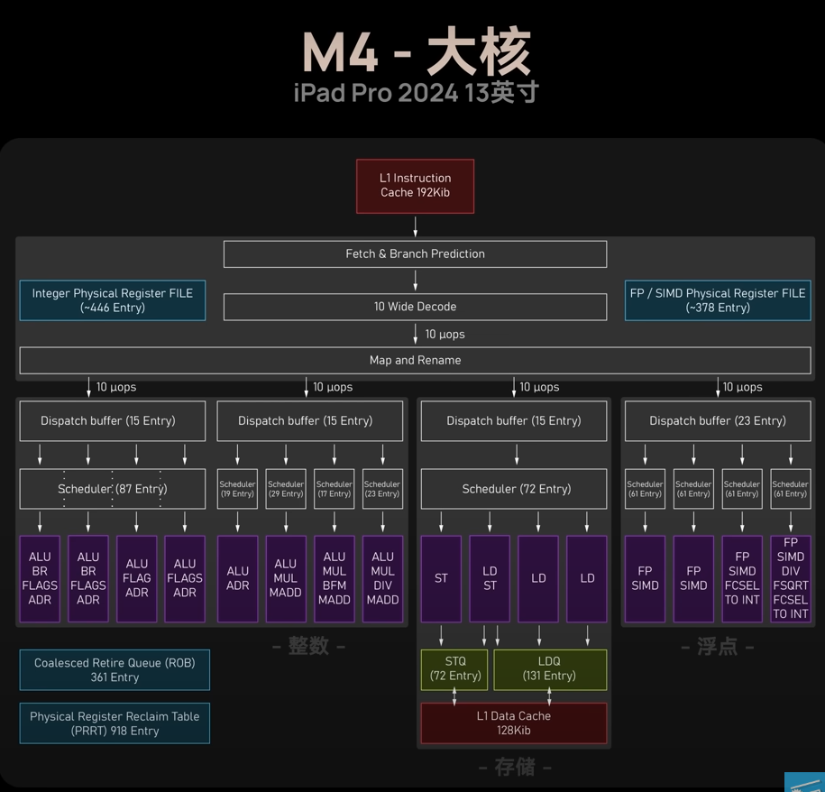

Base
====

Copying Data
------------

1. copy_asm_0
^^^^^^^^^^^^^

**Task**: Implement the function ``copy_asm_0`` using only base instructions. The function should have the same functionality as its C counterpart.

File ``submissions/submission_25_04_24/copy_asm.s``

2. copy_asm_1
^^^^^^^^^^^^^

**Task**: Implement the function ``copy_asm_1`` using only base instructions. The function should have the same functionality as its C counterpart.

File: ``submissions/submission_25_04_24/copy_asm.s``

Compile:

- ``as copy_asm.s -o copy_asm.o``
- ``gcc -c copy_c.c -o copy_c.o``
- ``g++ -o copy_driver.exe copy_driver.cpp copy_c.o copy_asm.o``
- .. image:: ../_static/images/report_25_04_24/copying-data.png
    :align: center

Instruction Throughput and Latency
----------------------------------

Files: ``submissions/submission_25_05_24/``
    - ``benchmark_driver.cpp``
    - ``benchmark.s``

Compile: ``g++ benchmark_driver.cpp benchmark.s -o benchmark.exe``

Output:

1. Instruction Throughput
^^^^^^^^^^^^^^^^^^^^^^^^^

**Task**: Microbenchmark the instruction throughput of ADD (shifted register) and MUL.

The first two blocks of the output shows the throughput benchmarks for ``ADD`` and ``MUL``:

To better understand the throughput, we need to look at the architecture of a M4 performance core.
In the image below, we see that 8 ALU's of different configurations are present.
As we use the ``ADD`` instruction only the ALU's with the ``ADR`` specification are relevant to us, which are 5 out of 8.
Same goes for the ``MUL`` instruction, where we only have 3 out of 8 ALU's able to perform multiplication.
With this knowledge we can now calculate the throughput of the ``ADD`` and ``MUL`` instruction.

    Source: https://www.youtube.com/watch?v=EbDPvcbilCs&t=257s

**ADD:**

We have :math:`22.2845 \cdot 10^9` instructions per second.
That are :math:`22.2845 \cdot 10^9 / 5 = 4.4569 \cdot 10^9` instructions per ALU per second.
This aligns with a **throughput of 1 instruction per cycle**, as it is known from benchmarks that the performance cores of the M4 chip have a clock speed of 4.4 GHz. 

**MUL:**

We have :math:`13.2967 \cdot 10^9` instruction per second.
That resolves to :math:`13.2967 \cdot 10^9 / 3 = 4.4322 \cdot 10^9` instructions per ALU per second. 
This result also aligns with a **throughput of 1 instruction per cycle** for a known clock speed of 4.4 GHz.

2. Instruction Latency
^^^^^^^^^^^^^^^^^^^^^^

**Task**: Microbenchmark the instruction latency of ADD (shifted register) and MUL.

The last two blocks of the output shows the latency benchmarks for ``ADD`` and ``MUL``.
Note, that we use read-after-write dependencies to measure the latency, thus we only use a single ALU for measurement.

**ADD:**

We have :math:`4.38367 \cdot 10^9` instruction per seconds in a single ALU.
Resulting in a **latency of 1 cycle** for the known clock speed of 4.4 GHz.

**MUL:**

We have :math:`1.46179 \cdot 10^9` instruction per seconds in a single ALU.
Resulting in a **latency of** :math:`4.4 \text{ GHz} / 1.46179 \cdot 10^9  \approx 3` **cycles**.