Code Generation
===============

This chapter introduces the code generation of the kernels developed in :doc:`neon` chapter supporting Aarch64 instructions.
We will take a look at a wrapper of the Aarch64 instructions to generate 32 bit instructions during the runtime that will than be used to
compose the kernels.

The general workflow of generating JITed code is:
1. Generate the kernel.
2. Write the kernel to a new memory page.
3. Make the memory page executable & flush the instruction cache to load the page.
4. Use the pointer to the memory page as a function pointer to execute the JITed kernel.

| The files to the Aarch64 wrappers are located in the ``src/main/arm_instructions/`` directory.
| The files to the composed kernels are located in the ``src/main/kernels/`` directory.
| All files related to the tasks of this chapter can be found under ``src/main/``.

.. note::

    All files a equivalent tests located in the ``src/test/`` directory with the same name extended by ``.test.``

BRGEMM Primitive
----------------

First, we will develop software that generates batch-reduce matrix-matrix multiplications (BRGEMMs) i.e. :math:`C\ \)\(+\)\(=\)\(\ \sum_i A_i \cdot B_i`.

- Files:
    - ``Brgemm.cpp``
    - ``Kernel.cpp``

Microkernel
^^^^^^^^^^^

In this section we take first steps of code generation by wrapping the Aarch64 instructions and writing the first ``matmul_16_6_1`` kernel
with variable k loop size.

1. Generate
"""""""""""

**Task**: Start implementing the ``generate`` function. Support only the single setting of an FP32 Neon microkernel that computes C+=AB for
column-major matrices and M=16, N=6, and K=1. Return an appropriate error code if the parameters of the function differ from this setting.

The ``generate`` function will be used to compose the correct matrix multiplication kernel to a given set of parameters: Dimension size of 
*M*, *N*, *K*, *Batch*, column- or row-major format of matrices *A*, *B*, *C*, and *data type*.

At runtime we can then call the generated kernel and propagate the pointer to the *A*, *B*, *C* matrices along with their respective leading dimension
and the batch stride of the *A* and *B* matrices.

To compose our kernel we need to write the correct Aarch64 instructions as 32 bit representation i.e. ``uin32_t`` to a consecutive memory space.
To write the instructions in a more assembly like manner we wrapped each required instruction into a function.
Thus, each instruction we generate has a wrapper which is based on the following structure:

1. First asserts are placed to check if the instruction is used correctly to evade most errors from misusage.

2. The instruction is build using masking operation and shifts to the starting bit of the opcode "block". 

For example the post variant of the load instructions with an immediate (`LDR (immediate) <https://developer.arm.com/documentation/ddi0602/2025-03/Base-Instructions/LDR--immediate---Load-register--immediate--?lang=en>`_):

.. code-block:: cpp
    :linenos:

    constexpr uint32_t ldrImmediatePost(const uint32_t Rt, const uint32_t Rn, const int32_t imm9, const bool is64bit)
    {
        release_assert(((Rt & mask5) == Rt), "Rt is only allowed to have a size of 5 bit.");
        release_assert(((Rn & mask5) == Rn), "Rn is only allowed to have a size of 5 bit.");
        release_assert(imm9 <= 255, "imm9 has a Maximum of 255");
        release_assert(imm9 >= -256, "imm9 has a Minimum of -256");

        uint32_t ldr = 0;
        ldr |= 0b1 << 31; // size bit 31
        ldr |= (is64bit & mask1) << 30;
        ldr |= 0b111000010 << 21; // opc 29 - 21
        ldr |= (imm9 & mask9) << 12;
        ldr |= 0b01 << 10; // opc 11 - 10
        ldr |= (Rn & mask5) << 5;
        ldr |= (Rt & mask5) << 0;
        return ldr;
    }

This function then gets wrapped to match the definition of our enum class for each register.

.. code-block:: cpp
    :linenos:

    constexpr uint32_t ldrPost(const R32Bit Wt, const R64Bit Xn, const int32_t imm9)
    {
        return internal::ldrImmediatePost(static_cast<uint32_t>(Wt), static_cast<uint32_t>(Xn), imm9, false);
    }

    constexpr uint32_t ldrPost(const R64Bit Xt, const R64Bit Xn, const int32_t imm9)
    {
        return internal::ldrImmediatePost(static_cast<uint32_t>(Xt), static_cast<uint32_t>(Xn), imm9, true);
    }

.. note::

    All these function have the keyword `constexpr` at the start.
    This has the benefit that most processing of the instruction can be done at compile time.
    Such that we get the following assembly code is produces:

    1. All inputs are fixed, it compiles into 2 mov instructions

        .. code-block:: asm

            mov w1, #38073                      // =0x94b9
            movk w1, #63557, lsl #16

    2. On input is known at runtime, it compiles into 3 instructions

        .. code-block:: asm

            mov w1, #38048                      // =0x94a0
            movk w1, #63557, lsl #16
            bfxil x1, x8, #0, #5
    
    Thus we do speedup the creation of the code generation, as most inputs are known at compile time.

After writing a lot wrappers around the arm instructions.
We can translate our previous assembly kernel using ``c++`` function and generate the ``matmul_16_6_1`` at runtime.

.. code-block:: cpp
    :linenos:

    void mini_jit::kernels::matmul_16_6_1(mini_jit::Kernel &kernel)
    {
        using namespace mini_jit::arm_instructions;

        kernel.add({
            // Offset the used leading dimension by the size of floats
            lsl(x3, x3, 2), // lsl x3, x3, #2
            lsl(x4, x4, 2), // lsl x4, x4, #2
            lsl(x5, x5, 2), // lsl x5, x5, #2

            // Load all data from the 16x1 matrix a
            ld1(v0, t4s, v1, t4s, v2, t4s, v3, t4s, x0) // ld1 {v0.4s, v1.4s, v2.4s, v3.4s}, [x0]
        });

        for (int i = 0; i < 2; i++)
        {
            kernel.add({
                // Load first element from the 1x6 matrix b
                ldr(s4, x1),     // ldr s4, [x1] WARNING
                add(x1, x1, x4), // add x1, x1, x4
                // Load first column from the 16x6 matrix c
                ld1(v25, t4s, v26, t4s, v27, t4s, v28, t4s, x2), // ld1 {v25.4s, v26.4s, v27.4s, v28.4s}, [x2]

                // Calculate first column of c
                fmla(v25, t4s, v0, t4s, v4, 0), // fmla v25.4s, v0.4s, v4.s[0]
                fmla(v26, t4s, v1, t4s, v4, 0), // fmla v26.4s, v1.4s, v4.s[0]
                fmla(v27, t4s, v2, t4s, v4, 0), // fmla v27.4s, v2.4s, v4.s[0]
                fmla(v28, t4s, v3, t4s, v4, 0), // fmla v28.4s, v3.4s, v4.s[0]

                // Store first column back to memory
                st1Post(v25, t4s, v26, t4s, v27, t4s, v28, t4s, x2, x5), // st1 {v25.4s, v26.4s, v27.4s, v28.4s}, [x2], x5

                // Load second element from the 1x6 matrix b
                ldr(s4, x1),     // ldr s4, [x1]
                add(x1, x1, x4), // add x1, x1, x4
                // Load second column from the 16x6 matrix c
                ld1(v17, t4s, v18, t4s, v19, t4s, v20, t4s, x2), // ld1 {v17.4s, v18.4s, v19.4s, v20.4s}, [x2]

                // Calculate second column of c
                fmla(v17, t4s, v0, t4s, v4, 0), // fmla v17.4s, v0.4s, v4.s[0]
                fmla(v18, t4s, v1, t4s, v4, 0), // fmla v18.4s, v1.4s, v4.s[0]
                fmla(v19, t4s, v2, t4s, v4, 0), // fmla v19.4s, v2.4s, v4.s[0]
                fmla(v20, t4s, v3, t4s, v4, 0), // fmla v20.4s, v3.4s, v4.s[0]

                // Store second column back to memory
                st1Post(v17, t4s, v18, t4s, v19, t4s, v20, t4s, x2, x5), // st1 {v17.4s, v18.4s, v19.4s, v20.4s}, [x2], x5

                // Load third element from the 1x6 matrix b
                ldr(s4, x1),     // ldr s4, [x1]
                add(x1, x1, x4), // add x1, x1, x4
                // Load third column from the 16x6 matrix c
                ld1(v21, t4s, v22, t4s, v23, t4s, v24, t4s, x2), // ld1 {v21.4s, v22.4s, v23.4s, v24.4s}, [x2]

                // Calculated third column of c
                fmla(v21, t4s, v0, t4s, v4, 0), // fmla v21.4s, v0.4s, v4.s[0]
                fmla(v22, t4s, v1, t4s, v4, 0), // fmla v22.4s, v1.4s, v4.s[0]
                fmla(v23, t4s, v2, t4s, v4, 0), // fmla v23.4s, v2.4s, v4.s[0]
                fmla(v24, t4s, v3, t4s, v4, 0), // fmla v24.4s, v3.4s, v4.s[0]

                // Store third column back to memory
                st1Post(v21, t4s, v22, t4s, v23, t4s, v24, t4s, x2, x5), // st1 {v21.4s, v22.4s, v23.4s, v24.4s}, [x2], x5
            });
        }

        kernel.add(ret()); // ret

        kernel.write("matmul_16_6_1.bin");
    }

In the original assembly we used ``.rept 2``.
We can replicate that using a simple ``for loop``.

.. note::

    The kernel has two add functions. One for adding an ``uint32_t`` and one to add a ``vector<uint32_t>``.
    To reduce writing overhead of ``kernel.add``.

2. k parameter support
""""""""""""""""""""""

**Task**: Add support for the ``k`` parameter by generating a K loop around the microkernel.

Adding support for the k parameter does require adding more wrapped instructions.
But then we can port our assembly kernel to ``c++`` and jit the k loop parameter.

.. code-block:: cpp
    :emphasize-lines: 46, 130
    :linenos:

    void mini_jit::kernels::matmul_16_6_k(mini_jit::Kernel &kernel, const uint32_t k_loop)
    {
        using namespace mini_jit::arm_instructions;

        // Procedural Call Standard
        // save frame pointer and link register
        kernel.add({

            stpPre(fp, lr, sp, -16),  // stp fp, lr, [sp, #-16]!
            // update frame pointer to current stack pointer
            movSp(fp, sp),  // mov fp, sp
                
            // save callee-saved registers
            stpPre(x19, x20, sp, -16),  // stp x19, x20, [sp, #-16]!
            stpPre(x21, x22, sp, -16),  // stp x21, x22, [sp, #-16]!
            stpPre(x23, x24, sp, -16),  // stp x23, x24, [sp, #-16]!
            stpPre(x25, x26, sp, -16),  // stp x25, x26, [sp, #-16]!
            stpPre(x27, x28, sp, -16),  // stp x27, x28, [sp, #-16]!

            stpPre(d8, d9, sp, -16),  // stp  d8,  d9, [sp, #-16]!
            stpPre(d10, d11, sp, -16),  // stp d10, d11, [sp, #-16]!
            stpPre(d12, d13, sp, -16),  // stp d12, d13, [sp, #-16]!
            stpPre(d14, d15, sp, -16),  // stp d14, d15, [sp, #-16]!

            // Offset the used leading dimension by the size of floats
            lsl(x3, x3, 2),  // lsl x3, x3, #2
            lsl(x4, x4, 2),  // lsl x4, x4, #2
            lsl(x5, x5, 2),  // lsl x5, x5, #2

            mov(x6, x1),  // mov x6, x1
            mov(x7, x2),  // mov x7, x2

            // Load first column from the 16x6 matrix c
            ld1Post(v25, t4s, v26, t4s, v27, t4s, v28, t4s, x2, x5),  // ld1 {v25.4s, v26.4s, v27.4s, v28.4s}, [x2], x5
            // Load second column from the 16x6 matrix c
            ld1Post(v17, t4s, v18, t4s, v19, t4s, v20, t4s, x2, x5),  // ld1 {v17.4s, v18.4s, v19.4s, v20.4s}, [x2], x5
            // Load third column from the 16x6 matrix c
            ld1Post(v21, t4s, v22, t4s, v23, t4s, v24, t4s, x2, x5),  // ld1 {v21.4s, v22.4s, v23.4s, v24.4s}, [x2], x5
            // Load fourth column from the 16x6 matrix c
            ld1Post(v5, t4s, v6, t4s, v7, t4s, v8, t4s, x2, x5),  // ld1 {v5.4s, v6.4s, v7.4s, v8.4s}, [x2], x5
            // Load fifth column from the 16x6 matrix c
            ld1Post(v9, t4s, v10, t4s, v11, t4s, v12, t4s, x2, x5),  // ld1 {v9.4s, v10.4s, v11.4s, v12.4s}, [x2], x5
            // Load sixth column from the 16x6 matrix c
            ld1Post(v13, t4s, v14, t4s, v15, t4s, v16, t4s, x2, x5),  // ld1 {v13.4s, v14.4s, v15.4s, v16.4s}, [x2], x5

            movz(x9, k_loop),  // mov x9, "iterator for K loop"
            
            // #############################
            // #### matmul_loop_over_K: ####
            // #############################
            sub(x9, x9, 1),  // sub x9, x9, #1

            // Load first column data from the 16x1 matrix a
            ld1Post(v0, t4s, v1, t4s, v2, t4s, v3, t4s, x0, x3),  // ld1 {v0.4s, v1.4s, v2.4s, v3.4s}, [x0], x3

            // run the known matmul_16_6_1_unrolled kernel
            // Load first element from the 1x6 matrix b
            ldr(s4, x1),  // ldr s4, [x1]
            add(x1, x1, x4),  // add x1, x1, x4

            // Calculate first column of c
            fmla(v25, t4s, v0, t4s, v4, 0),  // fmla v25.4s, v0.4s, v4.s[0]
            fmla(v26, t4s, v1, t4s, v4, 0),  // fmla v26.4s, v1.4s, v4.s[0]
            fmla(v27, t4s, v2, t4s, v4, 0),  // fmla v27.4s, v2.4s, v4.s[0]
            fmla(v28, t4s, v3, t4s, v4, 0),  // fmla v28.4s, v3.4s, v4.s[0]

            // Load second element from the 1x6 matrix b
            ldr(s4, x1),  // ldr s4, [x1]
            add(x1, x1, x4),  // add x1, x1, x4

            // Calculate second column of c
            fmla(v17, t4s, v0, t4s, v4, 0),  // fmla v17.4s, v0.4s, v4.s[0]
            fmla(v18, t4s, v1, t4s, v4, 0),  // fmla v18.4s, v1.4s, v4.s[0]
            fmla(v19, t4s, v2, t4s, v4, 0),  // fmla v19.4s, v2.4s, v4.s[0]
            fmla(v20, t4s, v3, t4s, v4, 0),  // fmla v20.4s, v3.4s, v4.s[0]

                
            // Load third element from the 1x6 matrix b
            ldr(s4, x1),  // ldr s4, [x1]
            add(x1, x1, x4),  // add x1, x1, x4

            // Calculated third column of c
            fmla(v21, t4s, v0, t4s, v4, 0),  // fmla v21.4s, v0.4s, v4.s[0]
            fmla(v22, t4s, v1, t4s, v4, 0),  // fmla v22.4s, v1.4s, v4.s[0]
            fmla(v23, t4s, v2, t4s, v4, 0),  // fmla v23.4s, v2.4s, v4.s[0]
            fmla(v24, t4s, v3, t4s, v4, 0),  // fmla v24.4s, v3.4s, v4.s[0]

            // Load fourth element from the 1x6 matrix b
            ldr(s4, x1),  // ldr s4, [x1]
            add(x1, x1, x4),  // add x1, x1, x4

            // Calculate fourth column of c
            fmla(v5, t4s, v0, t4s, v4, 0),  // fmla v5.4s, v0.4s, v4.s[0]
            fmla(v6, t4s, v1, t4s, v4, 0),  // fmla v6.4s, v1.4s, v4.s[0]
            fmla(v7, t4s, v2, t4s, v4, 0),  // fmla v7.4s, v2.4s, v4.s[0]
            fmla(v8, t4s, v3, t4s, v4, 0),  // fmla v8.4s, v3.4s, v4.s[0]

            // Load fifth element from the 1x6 matrix b
            ldr(s4, x1),  // ldr s4, [x1]
            add(x1, x1, x4),  // add x1, x1, x4

            // Calculate fifth column of c
            fmla(v9, t4s, v0, t4s, v4, 0),  // fmla v9.4s, v0.4s, v4.s[0]
            fmla(v10, t4s, v1, t4s, v4, 0),  // fmla v10.4s, v1.4s, v4.s[0]
            fmla(v11, t4s, v2, t4s, v4, 0),  // fmla v11.4s, v2.4s, v4.s[0]
            fmla(v12, t4s, v3, t4s, v4, 0),  // fmla v12.4s, v3.4s, v4.s[0]

                
            // Load sixth element from the 1x6 matrix b
            ldr(s4, x1),  // ldr s4, [x1]
            add(x1, x1, x4),  // add x1, x1, x4

            // Calculated sixth column of c
            fmla(v13, t4s, v0, t4s, v4, 0),  // fmla v13.4s, v0.4s, v4.s[0]
            fmla(v14, t4s, v1, t4s, v4, 0),  // fmla v14.4s, v1.4s, v4.s[0]
            fmla(v15, t4s, v2, t4s, v4, 0),  // fmla v15.4s, v2.4s, v4.s[0]
            fmla(v16, t4s, v3, t4s, v4, 0),  // fmla v16.4s, v3.4s, v4.s[0]

            // offset x6 to the next element in the column
            add(x6, x6, 4),  // add x6, x6, #4 // #4 = sizeof(float)

            // Restore x1 to be incremented again
            mov(x1, x6),  // mov x1, x6

            // Loop back
            cbnz(x9, -40*4),  // cbnz x9, matmul_loop_over_K

            // Restore initial value of x2 that was changed by the loads
            mov(x2, x7),  // mov x2, x7

            // Store first column back to memory
            st1Post(v25, t4s, v26, t4s, v27, t4s, v28, t4s, x2, x5),  // st1 {v25.4s, v26.4s, v27.4s, v28.4s}, [x2], x5 
            // Store second column back to memory
            st1Post(v17, t4s, v18, t4s, v19, t4s, v20, t4s, x2, x5),  // st1 {v17.4s, v18.4s, v19.4s, v20.4s}, [x2], x5
            // Store third column back to memory
            st1Post(v21, t4s, v22, t4s, v23, t4s, v24, t4s, x2, x5),  // st1 {v21.4s, v22.4s, v23.4s, v24.4s}, [x2], x5
            // Store fourth column back to memory
            st1Post(v5, t4s, v6, t4s, v7, t4s, v8, t4s, x2, x5),  // st1 {v5.4s, v6.4s, v7.4s, v8.4s}, [x2], x5 
            // Store fifth column back to memory
            st1Post(v9, t4s, v10, t4s, v11, t4s, v12, t4s, x2, x5),  // st1 {v9.4s, v10.4s, v11.4s, v12.4s}, [x2], x5
            // Store sixth column back to memory
            st1Post(v13, t4s, v14, t4s, v15, t4s, v16, t4s, x2, x5),  // st1 {v13.4s, v14.4s, v15.4s, v16.4s}, [x2], x5

            // Procedural Call Standard
            // restore callee-saved registers
            ldpPost(d14, d15, sp, 16),  // ldp d14, d15, [sp], #16
            ldpPost(d12, d13, sp, 16),  // ldp d12, d13, [sp], #16
            ldpPost(d10, d11, sp, 16),  // ldp d10, d11, [sp], #16
            ldpPost(d8, d9, sp, 16),  // ldp  d8,  d9, [sp], #16

            ldpPost(x27, x28, sp, 16),  // ldp x27, x28, [sp], #16
            ldpPost(x25, x26, sp, 16),  // ldp x25, x26, [sp], #16
            ldpPost(x23, x24, sp, 16),  // ldp x23, x24, [sp], #16
            ldpPost(x21, x22, sp, 16),  // ldp x21, x22, [sp], #16
            ldpPost(x19, x20, sp, 16),  // ldp x19, x20, [sp], #16

            // restore frame pointer and link register
            ldpPost(fp, lr, sp, 16),  // ldp fp, lr, [sp], #16

            ret()  // ret
        });

        kernel.write("matmul_16_6_k.bin");
    }

Looking at the first highlight.
This is our adjusted instruction at runtime, using the given loop count for the k dimension.

.. code-block:: cpp

    movz(x9, k_loop),  // mov x9, "iterator for K loop"

Another interesting instruction, is the second highlight.
We need to manually calculate the offset. Which in our case, we jump 40 instructions to loop again.

.. code-block:: cpp

    cbnz(x9, -40*4),  // cbnz x9, matmul_loop_over_K

3. Performance
"""""""""""""""

**Task**: Test the kernel generation. Report performance in GFLOPS.

Testing our JITed kernel, we get the same performance as out previous implementation.

.. note:: 

    The generation of the matmul kernel is done outside of the benchmarking loop, as one would do in a real world scenario.

.. code-block::
    :emphasize-lines: 4, 8

    ------------------------------------------------------------------------------------------------------------------------------------
    Benchmark                                                                               Time             CPU   Iterations      FLOPS
    ------------------------------------------------------------------------------------------------------------------------------------
    GemmJited16x6x1Fixture/BM_jited_matmul_16_6_1/min_warmup_time:1.000_mean             5.57 ns         5.56 ns           10 34.5601G/s
    GemmJited16x6x1Fixture/BM_jited_matmul_16_6_1/min_warmup_time:1.000_median           5.56 ns         5.55 ns           10 34.6245G/s
    GemmJited16x6x1Fixture/BM_jited_matmul_16_6_1/min_warmup_time:1.000_stddev          0.041 ns        0.040 ns           10 249.138M/s
    GemmJited16x6x1Fixture/BM_jited_matmul_16_6_1/min_warmup_time:1.000_cv               0.73 %          0.72 %            10      0.72%
    GemmJited16x6x128Fixture/BM_jited_matmul_16_6_128/min_warmup_time:1.000_mean          187 ns          187 ns           10 131.579G/s
    GemmJited16x6x128Fixture/BM_jited_matmul_16_6_128/min_warmup_time:1.000_median        187 ns          186 ns           10 131.811G/s
    GemmJited16x6x128Fixture/BM_jited_matmul_16_6_128/min_warmup_time:1.000_stddev       1.02 ns         1.01 ns           10 702.935M/s
    GemmJited16x6x128Fixture/BM_jited_matmul_16_6_128/min_warmup_time:1.000_cv           0.54 %          0.54 %            10      0.53%

- **jited_matmul_16_6_1** kernel: :math:`34.6` GFLOPS
- **jited_matmul_16_6_k(=128)** kernel: :math:`131.6` GFLOPS

GEMM
^^^^

We will now take a look at the basic GEMM implementation i.e. C+=AB.

1. Generate
"""""""""""

**Task**: Extend the implementation of the ``generate`` function to support all M-N-K combinations for C+=AB as specified above. Assume that all matrices are in column-major format.

To support all combinations of M, N and K, we use one kernel as a base and dynamically generate the rest of the numbers that are not multiples of M, N or K.
As a base we took the ``matmul_16m_4n_k`` kernel, which reached around ``130 GFLOPS`` as 64_48_64 kernel.
The k dimension is always a multiple of 1, thus we don't need a special case for this dimension. 
To get full coverage on the remaining dimension, we iteratively implemented the following variations:

- `matmul_16m_lt4nRest_k`: 
    - M dimension must be multiple of 16 
    - N dimension can be less than 4 or larger, multiple of 4 are processed at once, N mod 4 are processed at the end at once

- `matmul_16mRest_4n_k`:
    - M dimension can be larger than 16, multiple of 16 are processed at once, M mod 16 are processed at the end at once
    - N dimension must be multiple of 4

- `matmul_16mRest_lt4nRest_k`:
    - M dimension can be larger than 16, multiple of 16 are processed at once, M mod 16 are processed at the end at once
    - N dimension can be less than 4 or larger, multiple of 4 are processed at once, N mod 4 are processed at the end at once

- `matmul_lt16_4n_k`:
    - M dimension must be less than 16
    - N dimension must be multiple of 4

- `matmul_lt16_lt4nRest_k`:
    - M dimension must be less than 16
    - N dimension can be less than 4 or larger, multiple of 4 are processed at once, N mod 4 are processed at the end at once

Together with the `matmul_16m_4n_k`, we have 6 kernels to cover the complete dimension space.

.. image:: ../_static/images/report_25_05_15/matmul_coverage_light.svg
    :align: center
    :class: only-light

.. image:: ../_static/images/report_25_05_15/matmul_coverage_dark.svg
    :align: center
    :class: only-dark

2. Verify kernel generation
"""""""""""""""""""""""""""

**Task**: Verify your kernel generation by comparing to a reference implementation for 1≤M≤64, 1≤N≤64 and K∈[1,16,32,64,128], and by setting lda=M, ldb=K, ldc=M.

We tests all these configurations with counting upwards and random data. The tests can be found in ``Brgemm.test.cpp``. 
All test configuration habe passed.

3. Verfiy edge cases
""""""""""""""""""""

**Task**: Verify the kernel generation in cases where lda>M, ldb>K or ldc>M.

Also for higher leading dimension we tests all these configurations with counting upwards and random data. The tests can also be found in 
``Brgemm.test.cpp``.  All test configuration habe passed.

4. Performance
""""""""""""""

**Task**: Benchmark the performance of your generated kernels and report the measured performance for 1≤M≤64, 1≤N≤64, K∈[1,16,32,64,128],
lda=M, ldb=K and ldc=M. Use a CSV format for output. Follow the structure of the example file `data/perf.csv <https://github.com/scalable-analyses/pbtc/blob/main/lab/code_gen/data/perf.csv>`_.
Report the arithmetic mean performance of all settings in GFLOPS.

The benchmark took approximately eight hours in total to run. The following results were produced: :download:`GEMM_benchmarks.csv <../_static/resources/report_25_05_15/GEMM_benchmarks.csv>`

We can visualize the dataset across the three dimension m, n, k:

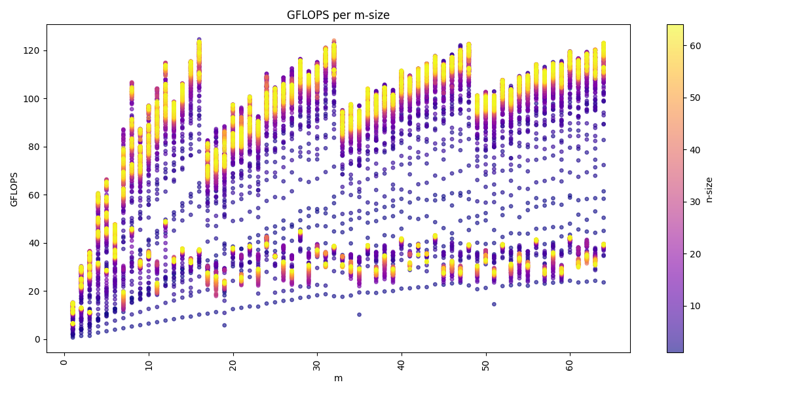

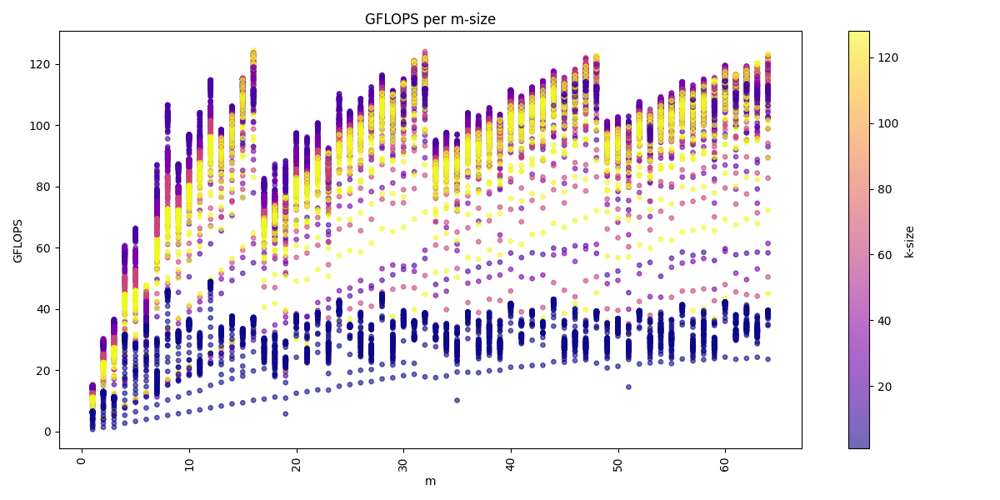

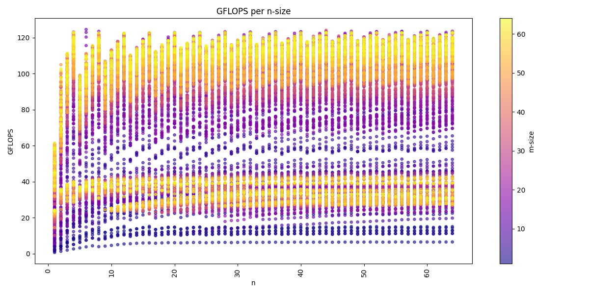

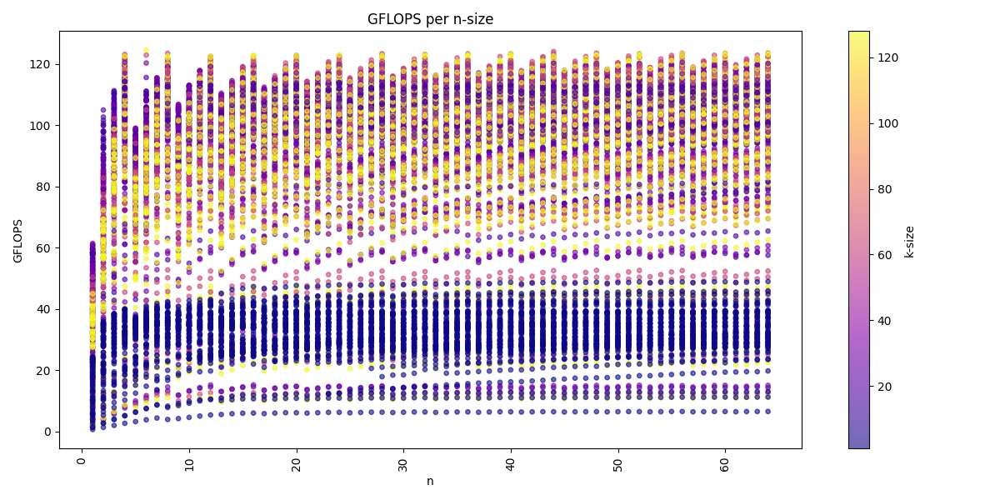

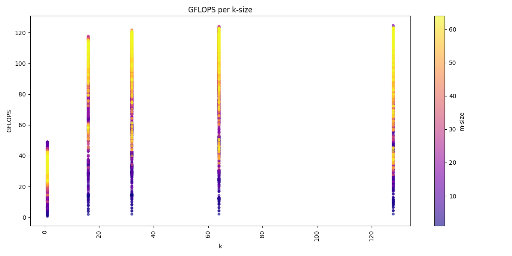

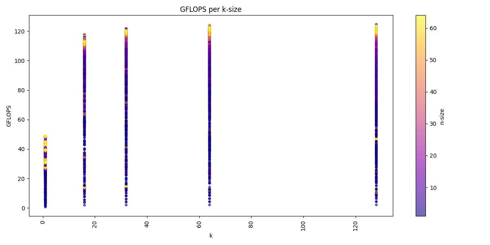

We see for the m-dimension that multiple of 16 are the best performing matrices sizes.
We also see that we get usually higher performance with increasing k-dimension and also a higher n-dimension, but a higher k-dimension is more important.

The arithmetic mean of all benchmarks is: **80.1 GFLOPS**

Batch-Reduce GEMM
^^^^^^^^^^^^^^^^^

Now we can extend the GEMM implementation by an additional batch-dimension i.e. C+=∑AᵢBᵢ.

1. generate
"""""""""""

**Task**: Extend the implementation of the ``generate`` function to support batch-reduce GEMMs: C+=∑AᵢBᵢ. Assume that all matrices are in column-major format.

In order to support an additional batch dimension in our implemented kernels, we placed all kernels within an additional batch loop.
Consequently, the logic in our ``Brgemm.cpp`` was extended to check whether the batch dimension is greater than one.

.. code-block:: cpp
    :linenos:
    :emphasize-lines: 19

    ...
    if (dtype != dtype_t::fp32)
    {
      return error_t::err_wrong_dtype;
    }
    if (m == 0 || n == 0 || k == 0)
    {
      return error_t::err_wrong_dimension;
    }
    if ((trans_a + trans_b + trans_c) != 0)
    {
      return error_t::err_row_major_order_not_supported;
    }

    if (br_size == 1 && (trans_a + trans_b + trans_c) == 0 && dtype == dtype_t::fp32)
    {
      fill_with_matmuls_no_batch_dim_column_major_fp32(m, n, k);
    }
    else if (br_size > 1 && (trans_a + trans_b + trans_c) == 0 && dtype == dtype_t::fp32)
    {
      fill_with_matmuls_batch_dim_column_major_fp32(m, n, k, br_size);
    }
    else
    {
      throw std::logic_error(
        std::format("Unhandled parameter combination found: m='{}', n='{}', k='{}', br_size='{}', trans_a='{}', trans_b='{}', "
                    "trans_c = '{}', dtype = '{}'",
                    m, n, k, br_size, trans_a, trans_b, trans_c, static_cast<int32_t>(dtype)));
    }
    ...

This ``else if`` branch distributes to our extended ``br_matmul_*`` kernels with a larger batch dimension.

- `br_matmul_16m_lt4nRest_k`
- `br_matmul_16mRest_4n_k`
- `br_matmul_16mRest_lt4nRest_k`
- `br_matmul_lt16_4n_k`
- `br_matmul_lt16_lt4nRest_k`

2. Verfiy
"""""""""

**Task**: Verify your generated kernels against a reference implementation.

All kernels were tested. The tests are located in the file ``src/test/kernels/br_matmul_*.test.cpp``.

The batched MatMul generation was tested for 1≤M≤64, 1≤N≤64, K∈[1,16,32,64,128], 1≤BatchSize≤16, lda=M, ldb=K, and ldc=M. 
The test is located in the file ``src/test/Brgemm.test.cpp``.

3. Performance
""""""""""""""

**Task**: Benchmark the performance of your generated kernels and report the measured performance for 1≤M≤64, 1≤N≤64, K∈[1,16,32,64,128],
br_size=16, br_stride_a=M*K, br_stride_b=K*N, lda=M, ldb=K, and ldc=M. Report the arithmetic mean performance of all settings in GFLOPS.

The benchmark took approximately eight hours in total to run. The following results were produced: :download:`GEMM_benchmarks.csv <../_static/resources/report_25_05_15/BR_GEMM_benchmarks.csv>`

We can visualize the dataset across the three dimension m, n, k:

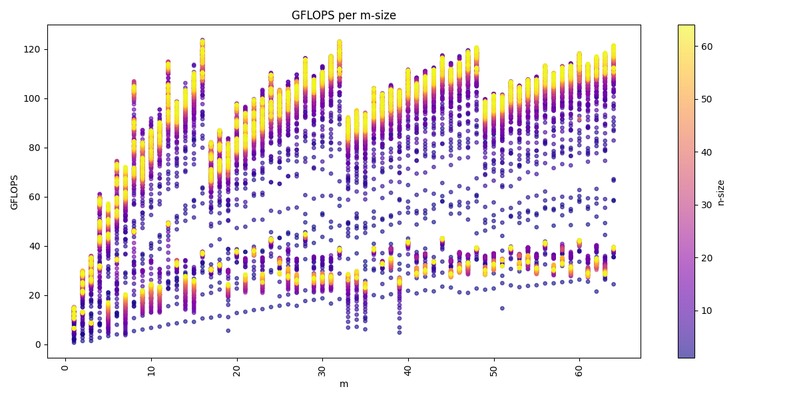

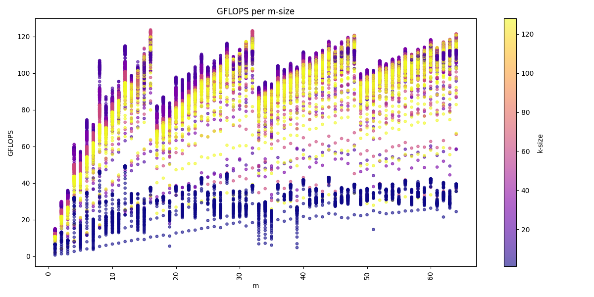

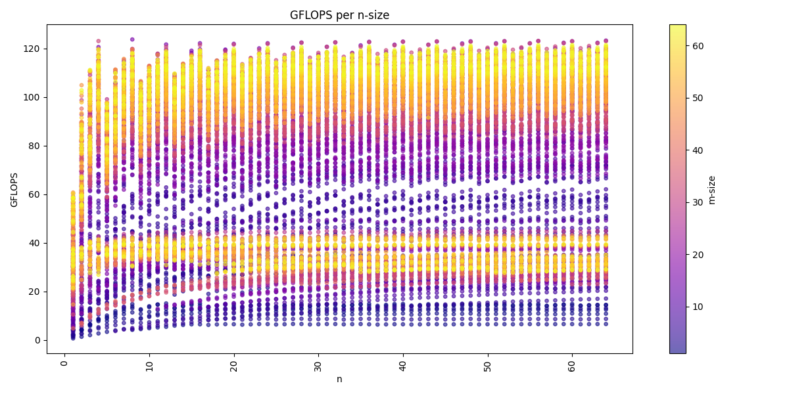

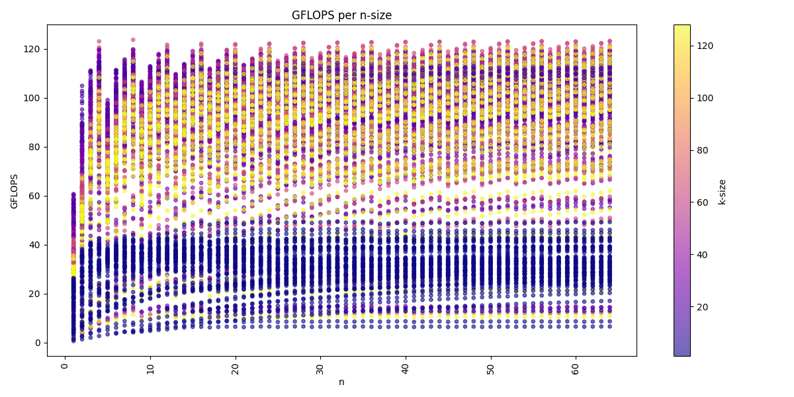

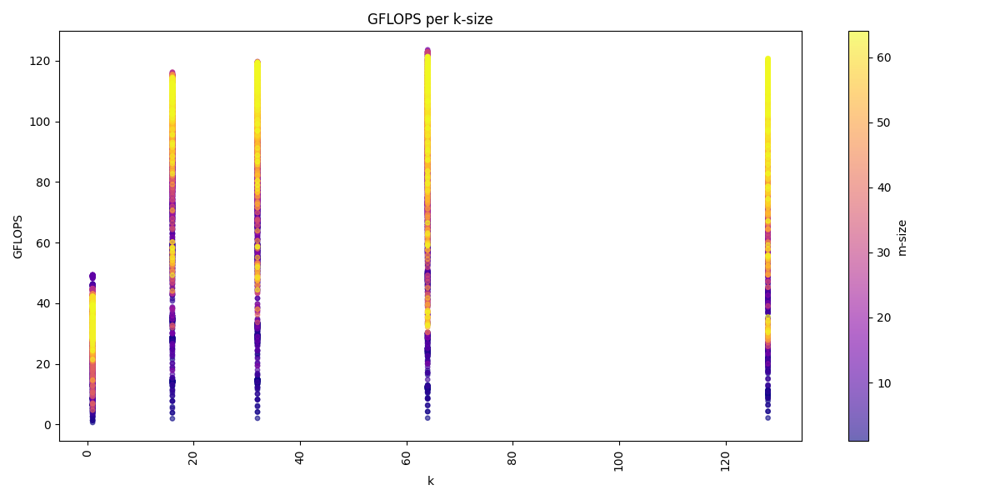

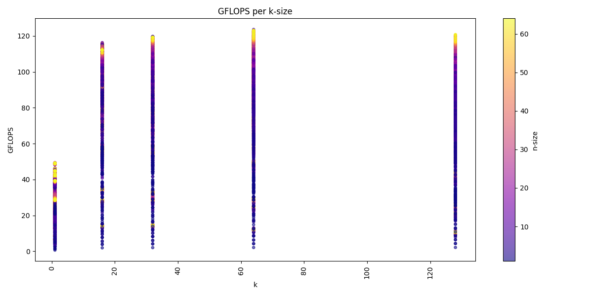

Again we see for the m-dimension that multiple of 16 are the best performing matrices sizes.
We also see that we get usually higher performance with increasing k-dimension and also a higher n-dimension, but a higher k-dimension is more important.
The batch-dimension does not have a noticeable impact on the performance compared to the benchmarks in the GEMM kernels.

| The arithmetic mean of all benchmarks is: **78.7 GFLOPS**
| Which indicates a small impact on performance compared to the GEMM kernels.

.. _unary_primitives:

Unary Primitives
----------------

Now we further extend our kernel with primitives.
Primitives are operation which only operate one one input i.e. B:=op(A).
We will take a look at the Zero, Identity and ReLu primitives and their transpose variants.

Zero Primitive
^^^^^^^^^^^^^^

This primitives ignores the input and filles all element of the output with zeros.

1. generate
"""""""""""

**Task**: Begin implementing the ``mini_jit::Unary::generate`` function by adding support for the zero primitive.

File: ``unary_zero.cpp``

Again we implement a ``generate`` function
which is used to compose the correct primitive kernel to a given set of parameters: Dimension size of 
*M*, *N*, column- or row-major format of matrices *B*, *data type*, and *Primitive type*.

At runtime we can then call the generated kernel and propagate the pointer to the *A*, *B* matrices along with their respective leading dimension.

For the zero primitive we zero four register which are then stored to the correct memory space.

.. note::

    This kernel is again used as a base and the we generate the rest of the number not multiple of M and dynamically.

.. code-block:: cpp

    ...
    // Zero four register so we can fill the matrix with zeros
    eor(v0, t16b, v0, t16b, v0, t16b),  // Zero the v0 register
    eor(v1, t16b, v1, t16b, v1, t16b),  // Zero the v1 register
    eor(v2, t16b, v2, t16b, v2, t16b),  // Zero the v2 register
    eor(v3, t16b, v3, t16b, v3, t16b),  // Zero the v3 register
    ...

    ...
    // x17 iterator for the m_loop
    mov(x17, m_loop_16),
    // loop over m
    sub(x17, x17, 1),

    st1Post(v0, t4s, v1, t4s, v2, t4s, v3, t4s, x1, x9),  // increase x1 after store with value of x2 i.e. x1 += 4 * 16 Byte

    // loop back to m
    cbnz(x17, -2 * 4),
    ...
  

2. Performance
""""""""""""""

**Task**: Test and benchmark representative kernels. Include at least settings with M=N=50, M=N=64, M=N=512 and M=N=2048. Report performance in GiB/s.

**Without Transposition**

.. code-block::
    :emphasize-lines: 4, 8, 12, 16

    -------------------------------------------------------------------------------------------------------------------------------
    Benchmark                                                                          Time             CPU   Iterations      Bytes
    -------------------------------------------------------------------------------------------------------------------------------
    UnaryFixture/BM_unary_zero/M:50/N:50/min_warmup_time:1.000_mean                 97.5 ns         97.2 ns           10 205.828G/s
    UnaryFixture/BM_unary_zero/M:50/N:50/min_warmup_time:1.000_median               97.3 ns         97.0 ns           10 206.267G/s
    UnaryFixture/BM_unary_zero/M:50/N:50/min_warmup_time:1.000_stddev              0.983 ns        0.980 ns           10 2.05822G/s
    UnaryFixture/BM_unary_zero/M:50/N:50/min_warmup_time:1.000_cv                   1.01 %          1.01 %            10      1.00%
    UnaryFixture/BM_unary_zero/M:64/N:64/min_warmup_time:1.000_mean                  186 ns          185 ns           10 176.895G/s
    UnaryFixture/BM_unary_zero/M:64/N:64/min_warmup_time:1.000_median                184 ns          183 ns           10 179.139G/s
    UnaryFixture/BM_unary_zero/M:64/N:64/min_warmup_time:1.000_stddev               7.19 ns         7.16 ns           10 6.55984G/s
    UnaryFixture/BM_unary_zero/M:64/N:64/min_warmup_time:1.000_cv                   3.86 %          3.86 %            10      3.71%
    UnaryFixture/BM_unary_zero/M:512/N:512/min_warmup_time:1.000_mean               9205 ns         9174 ns           10 228.836G/s
    UnaryFixture/BM_unary_zero/M:512/N:512/min_warmup_time:1.000_median             9345 ns         9314 ns           10 225.169G/s
    UnaryFixture/BM_unary_zero/M:512/N:512/min_warmup_time:1.000_stddev              316 ns          314 ns           10 7.95304G/s
    UnaryFixture/BM_unary_zero/M:512/N:512/min_warmup_time:1.000_cv                 3.43 %          3.43 %            10      3.48%
    UnaryFixture/BM_unary_zero/M:2048/N:2048/min_warmup_time:1.000_mean           265455 ns       264356 ns           10 127.786G/s
    UnaryFixture/BM_unary_zero/M:2048/N:2048/min_warmup_time:1.000_median         256886 ns       255806 ns           10 131.171G/s
    UnaryFixture/BM_unary_zero/M:2048/N:2048/min_warmup_time:1.000_stddev          24366 ns        24271 ns           10 10.4142G/s
    UnaryFixture/BM_unary_zero/M:2048/N:2048/min_warmup_time:1.000_cv               9.18 %          9.18 %            10      8.15%

- **BM_unary_zero/M:50/N:50** kernel: :math:`206.3` GiB/s
- **BM_unary_zero/M:64/N:64** kernel: :math:`176.9` GiB/s
- **BM_unary_zero/M:512/N:512** kernel: :math:`228.8` GiB/s
- **BM_unary_zero/M:2048/N:2048** kernel: :math:`127.8` GiB/s

**With Transposition**

Transposition is the equivalent operation with swapped M und N dimension. Thus we get the same performance.

Identity Primitive
^^^^^^^^^^^^^^^^^^

1. generate
"""""""""""

**Task**: Extend the implementation of the ``mini_jit::Unary::generate`` function to support the identity primitive.

Files: ``unary_identity.cpp`` & ``unary_identity_transpose.cpp``

Similar to the zero kernel but now we read the kernel from the *A* matrix and store the loaded values back the the *B* matrix.

.. code-block:: cpp

    ...
    // x17 iterator for the m_loop
    mov(x17, m_loop / 16),
    // loop over m
    sub(x17, x17, 1),

    ld1Post(v0, t4s, v1, t4s, v2, t4s, v3, t4s, x0, x9),  // increase x0 after load with value of x9 i.e. x0 += 4 * 4 * sizeof(float)
    st1Post(v0, t4s, v1, t4s, v2, t4s, v3, t4s, x1, x9),  // increase x1 after store with value of x9 i.e. x1 += 4 * 4 * sizeof(float)

    // loop back to m
    cbnz(x17, -3 * 4),
    ...

For the transpose kernel we implement a transposition on a generic matrix by transposing 4x4 blocks a storing them back to the correct positions.
Similar to the idea discussed in :ref:`Neon - Transpose <neon_transpose>`.

For example the transpose of the 4x4 block, where we again implemented transpose for all 16 combinations of :math:`(\le 4) \times (\le 4)`.
The function call to ``ops`` generates the correct operations on the loaded registers i.e. for the identity operation these does not append any instructions,
because we already load and store the transposed matrix.

.. code-block:: cpp

    ... 
    kernel.add({
        //    // Load
        ldr(q0, x4),      //    ldr q0, [x4]
        add(x4, x4, x2),  //    add x4, x4, x2
        ldr(q1, x4),      //    ldr q1, [x4]
        add(x4, x4, x2),  //    add x4, x4, x2
        ldr(q2, x4),      //    ldr q2, [x4]
        add(x4, x4, x2),  //    add x4, x4, x2
        ldr(q3, x4),      //    ldr q3, [x4]
    });
    ops(kernel, v0);
    ops(kernel, v1);
    ops(kernel, v2);
    ops(kernel, v3);
    kernel.add({
        //    // Transpose
        trn1(v4, t4s, v0, t4s, v1, t4s),   //    trn1 v4.4s, v0.4s, v1.4s
        trn2(v5, t4s, v0, t4s, v1, t4s),   //    trn2 v5.4s, v0.4s, v1.4s
        trn1(v6, t4s, v2, t4s, v3, t4s),   //    trn1 v6.4s, v2.4s, v3.4s
        trn2(v7, t4s, v2, t4s, v3, t4s),   //    trn2 v7.4s, v2.4s, v3.4s
                                           //
        zip1(v8, t2d, v4, t2d, v6, t2d),   //    zip1  v8.2d, v4.2d, v6.2d
        zip1(v9, t2d, v5, t2d, v7, t2d),   //    zip1  v9.2d, v5.2d, v7.2d
        zip2(v10, t2d, v4, t2d, v6, t2d),  //    zip2 v10.2d, v4.2d, v6.2d
        zip2(v11, t2d, v5, t2d, v7, t2d),  //    zip2 v11.2d, v5.2d, v7.2d

        //    // Store
        str(q8, x5),      //    str q8, [x5]
        add(x5, x5, x3),  //    add x5, x5, x3
        str(q9, x5),      //    str q9, [x5]
        add(x5, x5, x3),  //    add x5, x5, x3
        str(q10, x5),     //    str q10, [x5]
        add(x5, x5, x3),  //    add x5, x5, x3
        str(q11, x5),     //    str q11, [x5]
    });

2. Performance
""""""""""""""

**Task**: Test and benchmark representative kernels. Include at least settings with M=N=50, M=N=64, M=N=512 and M=N=2048. Report performance in GiB/s.

**Without Transposition**

.. code-block::
    :emphasize-lines: 4, 8, 12, 16

    -------------------------------------------------------------------------------------------------------------------------------
    Benchmark                                                                          Time             CPU   Iterations      Bytes
    -------------------------------------------------------------------------------------------------------------------------------
    UnaryFixture/BM_unary_identity/M:50/N:50/min_warmup_time:1.000_mean              129 ns          129 ns           10 155.397G/s
    UnaryFixture/BM_unary_identity/M:50/N:50/min_warmup_time:1.000_median            129 ns          128 ns           10 155.951G/s
    UnaryFixture/BM_unary_identity/M:50/N:50/min_warmup_time:1.000_stddev           1.53 ns         1.49 ns           10  1.7808G/s
    UnaryFixture/BM_unary_identity/M:50/N:50/min_warmup_time:1.000_cv               1.18 %          1.16 %            10      1.15%
    UnaryFixture/BM_unary_identity/M:64/N:64/min_warmup_time:1.000_mean              202 ns          202 ns           10 163.002G/s
    UnaryFixture/BM_unary_identity/M:64/N:64/min_warmup_time:1.000_median            200 ns          200 ns           10 164.143G/s
    UnaryFixture/BM_unary_identity/M:64/N:64/min_warmup_time:1.000_stddev           11.4 ns         11.3 ns           10 8.26683G/s
    UnaryFixture/BM_unary_identity/M:64/N:64/min_warmup_time:1.000_cv               5.65 %          5.62 %            10      5.07%
    UnaryFixture/BM_unary_identity/M:512/N:512/min_warmup_time:1.000_mean          16864 ns        16789 ns           10 125.139G/s
    UnaryFixture/BM_unary_identity/M:512/N:512/min_warmup_time:1.000_median        16468 ns        16388 ns           10 127.967G/s
    UnaryFixture/BM_unary_identity/M:512/N:512/min_warmup_time:1.000_stddev          776 ns          768 ns           10 5.48377G/s
    UnaryFixture/BM_unary_identity/M:512/N:512/min_warmup_time:1.000_cv             4.60 %          4.57 %            10      4.38%
    UnaryFixture/BM_unary_identity/M:2048/N:2048/min_warmup_time:1.000_mean       317943 ns       315684 ns           10 106.416G/s
    UnaryFixture/BM_unary_identity/M:2048/N:2048/min_warmup_time:1.000_median     316519 ns       314379 ns           10 106.733G/s
    UnaryFixture/BM_unary_identity/M:2048/N:2048/min_warmup_time:1.000_stddev      11615 ns        11358 ns           10  3.8664G/s
    UnaryFixture/BM_unary_identity/M:2048/N:2048/min_warmup_time:1.000_cv           3.65 %          3.60 %            10      3.63%

- **BM_unary_identity/M:50/N:50** kernel: :math:`155.4` GiB/s
- **BM_unary_identity/M:64/N:64** kernel: :math:`163.0` GiB/s
- **BM_unary_identity/M:512/N:512** kernel: :math:`125.1` GiB/s
- **BM_unary_identity/M:2048/N:2048** kernel: :math:`106.4` GiB/s

**With Transposition**

.. code-block::
    :emphasize-lines: 4, 8, 12, 16

    -----------------------------------------------------------------------------------------------------------------------------------------
    Benchmark                                                                                    Time             CPU   Iterations      Bytes
    -----------------------------------------------------------------------------------------------------------------------------------------
    UnaryFixture/BM_unary_identity_transpose/M:50/N:50/min_warmup_time:1.000_mean              157 ns          156 ns           10 128.118G/s
    UnaryFixture/BM_unary_identity_transpose/M:50/N:50/min_warmup_time:1.000_median            157 ns          156 ns           10 128.093G/s
    UnaryFixture/BM_unary_identity_transpose/M:50/N:50/min_warmup_time:1.000_stddev          0.734 ns        0.732 ns           10 600.086M/s
    UnaryFixture/BM_unary_identity_transpose/M:50/N:50/min_warmup_time:1.000_cv               0.47 %          0.47 %            10      0.47%
    UnaryFixture/BM_unary_identity_transpose/M:64/N:64/min_warmup_time:1.000_mean              252 ns          251 ns           10 130.502G/s
    UnaryFixture/BM_unary_identity_transpose/M:64/N:64/min_warmup_time:1.000_median            252 ns          251 ns           10  130.41G/s
    UnaryFixture/BM_unary_identity_transpose/M:64/N:64/min_warmup_time:1.000_stddev           1.12 ns         1.10 ns           10  573.58M/s
    UnaryFixture/BM_unary_identity_transpose/M:64/N:64/min_warmup_time:1.000_cv               0.44 %          0.44 %            10      0.44%
    UnaryFixture/BM_unary_identity_transpose/M:512/N:512/min_warmup_time:1.000_mean         477698 ns       476113 ns           10 4.40967G/s
    UnaryFixture/BM_unary_identity_transpose/M:512/N:512/min_warmup_time:1.000_median       478232 ns       476633 ns           10 4.39994G/s
    UnaryFixture/BM_unary_identity_transpose/M:512/N:512/min_warmup_time:1.000_stddev        16842 ns        16774 ns           10 155.727M/s
    UnaryFixture/BM_unary_identity_transpose/M:512/N:512/min_warmup_time:1.000_cv             3.53 %          3.52 %            10      3.53%
    UnaryFixture/BM_unary_identity_transpose/M:2048/N:2048/min_warmup_time:1.000_mean      8826949 ns      8790588 ns           10 3.81791G/s
    UnaryFixture/BM_unary_identity_transpose/M:2048/N:2048/min_warmup_time:1.000_median    8813603 ns      8778155 ns           10  3.8225G/s
    UnaryFixture/BM_unary_identity_transpose/M:2048/N:2048/min_warmup_time:1.000_stddev     137200 ns       136627 ns           10 59.0859M/s
    UnaryFixture/BM_unary_identity_transpose/M:2048/N:2048/min_warmup_time:1.000_cv           1.55 %          1.55 %            10      1.55%

- **BM_unary_identity_transpose/M:50/N:50** kernel: :math:`128.1` GiB/s
- **BM_unary_identity_transpose/M:64/N:64** kernel: :math:`130.5` GiB/s
- **BM_unary_identity_transpose/M:512/N:512** kernel: :math:`4.409` GiB/s
- **BM_unary_identity_transpose/M:2048/N:2048** kernel: :math:`3.817` GiB/s

ReLu Primitive
^^^^^^^^^^^^^^

1. generate
"""""""""""

**Task**: Extend the implementation of the ``mini_jit::Unary::generate`` function to support the ReLu primitive.

Files: ``unary_relu.cpp`` & ``unary_relu_transpose.cpp``

Here we do the exact same as the identity kernel in the transpose and none-transpose kernel, but with an additional hard-coded zero vector
register and and additional fmax between the load and the store operation.

.. code-block:: cpp

    ...
    // x17 iterator for the m_loop
    mov(x17, m_loop / 16),
    // loop over m
    sub(x17, x17, 1),

    ld1Post(v0, t4s, v1, t4s, v2, t4s, v3, t4s, x0, x9),  // increase x0 after load with value of x9 i.e. x0 += 4 * 4 * sizeof(float)
    fmax(v0, t4s, v0, t4s, v5, t4s),
    fmax(v1, t4s, v1, t4s, v5, t4s),
    fmax(v2, t4s, v2, t4s, v5, t4s),
    fmax(v3, t4s, v3, t4s, v5, t4s),
    st1Post(v0, t4s, v1, t4s, v2, t4s, v3, t4s, x1, x9),  // increase x1 after store with value of x9 i.e. x1 += 4 * 4 * sizeof(float)

    // loop back to m
    cbnz(x17, -7 * 4),
    ...

In addition, the ``ops`` function of the transpose kernel becomes:

.. code-block:: cpp

    void relu(mini_jit::Kernel &kernel, mini_jit::arm_instructions::VGeneral vRegister)
    {
        using namespace mini_jit::arm_instructions;
        kernel.add(fmax(vRegister, t4s, vRegister, t4s, v31, t4s));
    }

2. Performance
""""""""""""""

**Task**: Test and benchmark representative kernels. Include at least settings with M=N=50, M=N=64, M=N=512 and M=N=2048. Report performance in GiB/s.

**Without Transposition**

.. code-block::
    :emphasize-lines: 4, 8, 12, 16

    ---------------------------------------------------------------------------------------------------------------------------
    Benchmark                                                                      Time             CPU   Iterations      Bytes
    ---------------------------------------------------------------------------------------------------------------------------
    UnaryFixture/BM_unary_relu/M:50/N:50/min_warmup_time:1.000_mean                  141 ns          140 ns           10  143.13G/s
    UnaryFixture/BM_unary_relu/M:50/N:50/min_warmup_time:1.000_median                137 ns          137 ns           10 146.168G/s
    UnaryFixture/BM_unary_relu/M:50/N:50/min_warmup_time:1.000_stddev               8.16 ns         8.03 ns           10   7.717G/s
    UnaryFixture/BM_unary_relu/M:50/N:50/min_warmup_time:1.000_cv                   5.80 %          5.73 %            10      5.39%
    UnaryFixture/BM_unary_relu/M:64/N:64/min_warmup_time:1.000_mean                  223 ns          222 ns           10 147.933G/s
    UnaryFixture/BM_unary_relu/M:64/N:64/min_warmup_time:1.000_median                221 ns          220 ns           10 148.866G/s
    UnaryFixture/BM_unary_relu/M:64/N:64/min_warmup_time:1.000_stddev               14.6 ns         14.4 ns           10 9.37165G/s
    UnaryFixture/BM_unary_relu/M:64/N:64/min_warmup_time:1.000_cv                   6.56 %          6.49 %            10      6.34%
    UnaryFixture/BM_unary_relu/M:512/N:512/min_warmup_time:1.000_mean              16615 ns        16550 ns           10 126.752G/s
    UnaryFixture/BM_unary_relu/M:512/N:512/min_warmup_time:1.000_median            16695 ns        16624 ns           10 126.155G/s
    UnaryFixture/BM_unary_relu/M:512/N:512/min_warmup_time:1.000_stddev              281 ns          281 ns           10 2.24229G/s
    UnaryFixture/BM_unary_relu/M:512/N:512/min_warmup_time:1.000_cv                 1.69 %          1.70 %            10      1.77%
    UnaryFixture/BM_unary_relu/M:2048/N:2048/min_warmup_time:1.000_mean           314145 ns       312183 ns           10 107.534G/s
    UnaryFixture/BM_unary_relu/M:2048/N:2048/min_warmup_time:1.000_median         316017 ns       313907 ns           10 106.899G/s
    UnaryFixture/BM_unary_relu/M:2048/N:2048/min_warmup_time:1.000_stddev           7378 ns         7145 ns           10 2.48532G/s
    UnaryFixture/BM_unary_relu/M:2048/N:2048/min_warmup_time:1.000_cv               2.35 %          2.29 %            10      2.31%

- **BM_unary_relu/M:50/N:50** kernel: :math:`143.1` GiB/s
- **BM_unary_relu/M:64/N:64** kernel: :math:`148.0` GiB/s
- **BM_unary_relu/M:512/N:512** kernel: :math:`126.8` GiB/s
- **BM_unary_relu/M:2048/N:2048** kernel: :math:`107.5` GiB/s

**With Transposition**

.. code-block::
    :emphasize-lines: 4, 8, 12, 16

    -------------------------------------------------------------------------------------------------------------------------------------
    Benchmark                                                                                Time             CPU   Iterations      Bytes
    -------------------------------------------------------------------------------------------------------------------------------------
    UnaryFixture/BM_unary_relu_transpose/M:50/N:50/min_warmup_time:1.000_mean              159 ns          158 ns           10 126.468G/s
    UnaryFixture/BM_unary_relu_transpose/M:50/N:50/min_warmup_time:1.000_median            159 ns          158 ns           10 126.509G/s
    UnaryFixture/BM_unary_relu_transpose/M:50/N:50/min_warmup_time:1.000_stddev          0.839 ns        0.826 ns           10 660.394M/s
    UnaryFixture/BM_unary_relu_transpose/M:50/N:50/min_warmup_time:1.000_cv               0.53 %          0.52 %            10      0.52%
    UnaryFixture/BM_unary_relu_transpose/M:64/N:64/min_warmup_time:1.000_mean              244 ns          243 ns           10  134.75G/s
    UnaryFixture/BM_unary_relu_transpose/M:64/N:64/min_warmup_time:1.000_median            244 ns          243 ns           10 134.706G/s
    UnaryFixture/BM_unary_relu_transpose/M:64/N:64/min_warmup_time:1.000_stddev          0.405 ns        0.417 ns           10 231.018M/s
    UnaryFixture/BM_unary_relu_transpose/M:64/N:64/min_warmup_time:1.000_cv               0.17 %          0.17 %            10      0.17%
    UnaryFixture/BM_unary_relu_transpose/M:512/N:512/min_warmup_time:1.000_mean         481150 ns       479519 ns           10 4.37974G/s
    UnaryFixture/BM_unary_relu_transpose/M:512/N:512/min_warmup_time:1.000_median       483163 ns       481481 ns           10 4.35591G/s
    UnaryFixture/BM_unary_relu_transpose/M:512/N:512/min_warmup_time:1.000_stddev        19118 ns        19053 ns           10 176.288M/s
    UnaryFixture/BM_unary_relu_transpose/M:512/N:512/min_warmup_time:1.000_cv             3.97 %          3.97 %            10      4.03%
    UnaryFixture/BM_unary_relu_transpose/M:2048/N:2048/min_warmup_time:1.000_mean      8770935 ns      8729697 ns           10 3.84785G/s
    UnaryFixture/BM_unary_relu_transpose/M:2048/N:2048/min_warmup_time:1.000_median    8782429 ns      8746690 ns           10 3.83637G/s
    UnaryFixture/BM_unary_relu_transpose/M:2048/N:2048/min_warmup_time:1.000_stddev     305062 ns       299606 ns           10 133.989M/s
    UnaryFixture/BM_unary_relu_transpose/M:2048/N:2048/min_warmup_time:1.000_cv           3.48 %          3.43 %            10      3.48%

- **BM_unary_relu_transpose/M:50/N:50** kernel: :math:`126.4` GiB/s
- **BM_unary_relu_transpose/M:64/N:64** kernel: :math:`134.7` GiB/s
- **BM_unary_relu_transpose/M:512/N:512** kernel: :math:`4.379` GiB/s
- **BM_unary_relu_transpose/M:2048/N:2048** kernel: :math:`3.847` GiB/s