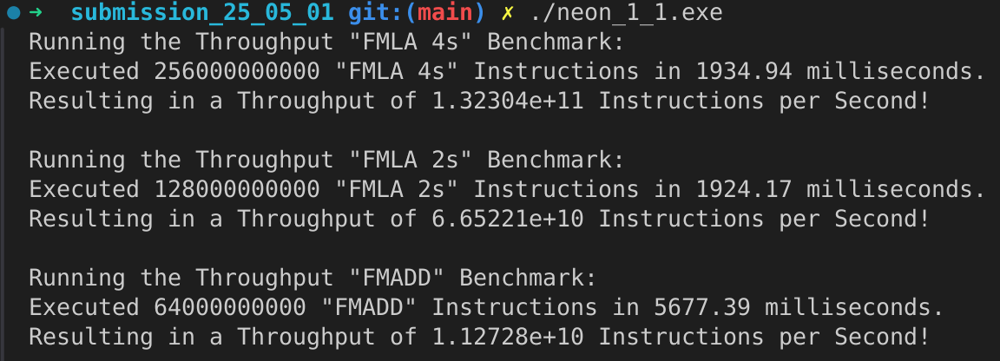
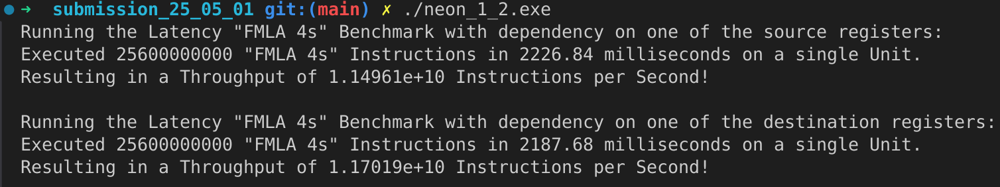

Submission 2025-05-01
=====================

Execution Throughput and Latency
--------------------------------

This section microbenchmarks the execution throughput and latency of FP32 Neon instructions.

1. Microbenchmark the execution throughput of the following instructions:
^^^^^^^^^^^^^^^^^^^^^^^^^^^^^^^^^^^^^^^^^^^^^^^^^^^^^^^^^^^^^^^^^^^^^^^^^

**FMLA (vector) with arrangement specifier ``4S``**

- File: ``submissions/submission_25_05_01/neon_1_1.s``
- Driver: ``submissions/submission_25_05_01/neon_1_1_driver.cpp``
- Compilation: ``g++ -o neon_1_1.exe neon_1_1_driver.cpp neon_1_1.s``
- We have :math:`13.2304 \cdot 10^10` instructions per second.
  That are :math:`13.2304 \cdot 10^10 / 8 = 16.538 \cdot 10^9` instructions per ALU per second.
  This aligns with a **throughput of** :math:`\approx 4` **instruction per cycle**, as it is known from benchmarks that the performance cores of the M4 chip have a clock speed of 4.4 GHz.

**FMLA (vector) with arrangement specifier ``2S``**

- File: ``submissions/submission_25_05_01/neon_1_1.s``
- Driver: ``submissions/submission_25_05_01/neon_1_1_driver.cpp``
- Compilation: ``g++ -o neon_1_1.exe neon_1_1_driver.cpp neon_1_1.s``
- We have :math:`6.65221 \cdot 10^10` instructions per second.
  That are :math:`6.65221 \cdot 10^10 / 8 = 8.31526 \cdot 10^9` instructions per ALU per second.
  This aligns with a **throughput of** :math:`\approx 2` **instruction per cycle**, as it is known from benchmarks that the performance cores of the M4 chip have a clock speed of 4.4 GHz.

**FMADD (scalar), single-precision variant**

- File: ``submissions/submission_25_05_01/neon_1_1.s``
- Driver: ``submissions/submission_25_05_01/neon_1_1_driver.cpp``
- Compilation: ``g++ -o neon_1_1.exe neon_1_1_driver.cpp neon_1_1.s``
- We have :math:`1.12728 \cdot 10^10` instructions per second.
  That are :math:`1.12728 \cdot 10^10 / 8 = 1.4091 \cdot 10^9` instructions per ALU per second.
  This aligns with a **throughput of** :math:`\approx 1/3` **instruction per cycle**, as it is known from benchmarks that the performance cores of the M4 chip have a clock speed of 4.4 GHz.

1. Microbenchmark the execution latency of FMLA (vector) with arrangement specifier 4S. Consider the following two cases:
^^^^^^^^^^^^^^^^^^^^^^^^^^^^^^^^^^^^^^^^^^^^^^^^^^^^^^^^^^^^^^^^^^^^^^^^^^^^^^^^^^^^^^^^^^^^^^^^^^^^^^^^^^^^^^^^^^^^^^^^^

**Dependency on one of the source registers**

- File: ``submissions/submission_25_05_01/neon_1_2.s``
- Driver: ``submissions/submission_25_05_01/neon_1_2_driver.cpp``
- Compilation: ``g++ -o neon_1_2.exe neon_1_2_driver.cpp neon_1_2.s``
- We have :math:`11.4961 \cdot 10^9` instruction per seconds in a single ALU.
  Resulting in a **latency of** :math:`\approx 1` **cycle** for the known clock speed of 4.4 GHz.

**Dependency on the destination register only**

- File: ``submissions/submission_25_05_01/neon_1_2.s``
- Driver: ``submissions/submission_25_05_01/neon_1_2_driver.cpp``
- Compilation: ``g++ -o neon_1_2.exe neon_1_2_driver.cpp neon_1_2.s``
- We have :math:`11.7019 \cdot 10^9` instruction per seconds in a single ALU.
  Resulting in a **latency of** :math:`\approx 3` **cycle** for the known clock speed of 4.4 GHz.
