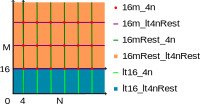
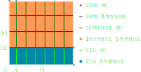

Submission 2025-05-15
=====================

Neon Batch-Reduce GEMM
----------------------

This section considers a batch-reduce matrix-matrix multiplication that has a fourth dimension in addition to the known M, N, and K dimensions.

1. Implement a batch-reduce kernel matmul_64_48_64_16
^^^^^^^^^^^^^^^^^^^^^^^^^^^^^^^^^^^^^^^^^^^^^^^^^^^^^

File: ``neon_6_1.s``

We started by implementing a kernel ``matmul_64_48_64`` with a batch dimension of one which is in the file ``neon_6_1_batch1.s``.

.. code-block:: asm
    :linenos:
    :emphasize-lines: 18

    ...
        mov x17, #12 // x17 iterator for N loop
    matmul_loop_over_N:
        sub x17, x17, #1

        ...

        mov x16, #4 // x16 iterator for M loop
    matmul_loop_over_M:
        sub x16, x16, #1

        ...

        mov x15, #64 // x15 iterator for K loop
    matmul_loop_over_K:
        sub x15, x15, #1

        ... matmul_16_4_1 kernel ...

        // Loop back to K
        cbnz x15, matmul_loop_over_K

        ...

        // Loop back to M
        cbnz x16, matmul_loop_over_M
        
        ...

        // Loop back to N
        cbnz x17, matmul_loop_over_N

Then we wrapped the ``matmul_64_48_64`` kernel inside another batch loop of size 16:

.. code-block:: asm
    :linenos:
    :emphasize-lines: 3, 41
  
    ...
        mov x19, #16 // x19 iterator for the batch dimension
    matmul_loop_batch_dimension:
        sub x19, x19, #1

        ...

        mov x17, #12 // x17 iterator for N loop
    matmul_loop_over_N:
        sub x17, x17, #1

        ...

        mov x16, #4 // x16 iterator for M loop
    matmul_loop_over_M:
        sub x16, x16, #1

        ...

        mov x15, #64 // x15 iterator for K loop
    matmul_loop_over_K:
        sub x15, x15, #1

        ...

        // Loop back to K
        cbnz x15, matmul_loop_over_K

        ... matmul_16_4_1 kernel ...

        // Loop back to M
        cbnz x16, matmul_loop_over_M
        
        ...

        // Loop back to N
        cbnz x17, matmul_loop_over_N

        ...

        // Loop back to batch dimension
        cbnz x19, matmul_loop_batch_dimension

2. Test and optimize
^^^^^^^^^^^^^^^^^^^^

We tested a variation in which the batch loop was positioned between the M and K loops. This approach achieved around :math:`73` GFLOPS. 
We suspect that the reason for this was that the matrices did not fit into the cache.
We do not follow this approach due to the poor performance, and we lost the file due to a false ``rm`` statement.

However, this leads us to assume that our result of putting the batch loop outside is satisfactory.

.. code-block::
    :emphasize-lines: 4, 8

    -----------------------------------------------------------------------------------------------------------------------------------------------
    Benchmark                                                                                          Time             CPU   Iterations      FLOPS
    -----------------------------------------------------------------------------------------------------------------------------------------------
    GemmMxNxKxBatchFixture<64, 48, 64, 1>/BM_matmul_64_48_64/min_warmup_time:1.000_mean             3104 ns         3093 ns           10 127.138G/s
    GemmMxNxKxBatchFixture<64, 48, 64, 1>/BM_matmul_64_48_64/min_warmup_time:1.000_median           3102 ns         3092 ns           10  127.19G/s
    GemmMxNxKxBatchFixture<64, 48, 64, 1>/BM_matmul_64_48_64/min_warmup_time:1.000_stddev           10.1 ns         8.08 ns           10 331.319M/s
    GemmMxNxKxBatchFixture<64, 48, 64, 1>/BM_matmul_64_48_64/min_warmup_time:1.000_cv               0.33 %          0.26 %            10      0.26%
    GemmMxNxKxBatchFixture<64, 48, 64, 16>/BM_matmul_64_48_64_16/min_warmup_time:1.000_mean        51072 ns        50890 ns           10 123.628G/s
    GemmMxNxKxBatchFixture<64, 48, 64, 16>/BM_matmul_64_48_64_16/min_warmup_time:1.000_median      51027 ns        50840 ns           10 123.749G/s
    GemmMxNxKxBatchFixture<64, 48, 64, 16>/BM_matmul_64_48_64_16/min_warmup_time:1.000_stddev        120 ns          119 ns           10 287.993M/s
    GemmMxNxKxBatchFixture<64, 48, 64, 16>/BM_matmul_64_48_64_16/min_warmup_time:1.000_cv           0.24 %          0.23 %            10      0.23%

- **matmul_64_48_64** kernel: :math:`127.1` GFLOPS
- **matmul_64_48_64_16** kernel: :math:`123.6` GFLOPS

GEMM
----

1. Extend generate to support M-N-K combinations for column-major format :math:`1 \leq M,N \leq 1024, 1 \leq K \leq 2028`
^^^^^^^^^^^^^^^^^^^^^^^^^^^^^^^^^^^^^^^^^^^^^^^^^^^^^^^^^^^^^^^^^^^^^^^^^^^^^^^^^^^^^^^^^^^^^^^^^^^^^^^^^^^^^^^^^^^^^^^^^

To support all combinations of M, N and K, we use one kernel as a base and dynamically generate the rest of the handling for numbers that are not multiples of M, N or K.
As a base we took the ``matmul_16m_4n_k`` kernel, which reached around ``130 GFLOPS`` as 64_48_64 kernel (i.e. the same as the kernel from the
previous section, with a batch dimension of one.). 
The k dimension is always a multiple of 1 therefore we don't need a special case for this dimension. 
To get full coverage on the remaining dimension, we implemented the following variations:

- `matmul_16m_lt4nRest_k`: 
    - M dimension must be multiple of 16 
    - N dimension can be less than 4 or larger, multiple of 4 are processed at once, N mod 4 are processed at the end at once

- `matmul_16mRest_4n_k`:
    - M dimension can be larger than 16, multiple of 16 are processed at once, M mod 16 are processed at the end at once
    - N dimension must be multiple of 4

- `matmul_16mRest_lt4nRest_k`:
    - M dimension can be larger than 16, multiple of 16 are processed at once, M mod 16 are processed at the end at once
    - N dimension can be less than 4 or larger, multiple of 4 are processed at once, N mod 4 are processed at the end at once

- `matmul_lt16_4n_k`:
    - M dimension must be less than 16
    - N dimension must be multiple of 4

- `matmul_lt16_lt4nRest_k`:
    - M dimension must be less than 16
    - N dimension can be less than 4 or larger, multiple of 4 are processed at once, N mod 4 are processed at the end at once

Together with the `matmul_16m_4n_k`, we have 6 kernels to cover the complete dimension space.

2. Verify all matrices for ``1≤M≤64``, ``1≤N≤64``, ``K∈[1,16,32,64,128]``,``lda=M``, ``ldb=K``, and ``ldc=M``
^^^^^^^^^^^^^^^^^^^^^^^^^^^^^^^^^^^^^^^^^^^^^^^^^^^^^^^^^^^^^^^^^^^^^^^^^^^^^^^^^^^^^^^^^^^^^^^^^^^^^^^^^^^^^

All GEMM generation and execution using this configuration works with counting upwards and random data.

3. Verify all matrices for ``1≤M≤64``, ``1≤N≤64``, ``K∈[1,16,32,64,128]``,``lda>M``, ``ldb>K``, and ``ldc>M``
^^^^^^^^^^^^^^^^^^^^^^^^^^^^^^^^^^^^^^^^^^^^^^^^^^^^^^^^^^^^^^^^^^^^^^^^^^^^^^^^^^^^^^^^^^^^^^^^^^^^^^^^^^^^^

All GEMM generation and execution using this configuration works with counting upwards and random data.

4. Benchmark for ``1≤M≤64``, ``1≤N≤64``, ``K∈[1,16,32,64,128]``,``lda=M``, ``ldb=K``, and ``ldc=M``. 
^^^^^^^^^^^^^^^^^^^^^^^^^^^^^^^^^^^^^^^^^^^^^^^^^^^^^^^^^^^^^^^^^^^^^^^^^^^^^^^^^^^^^^^^^^^^^^^^^^^^

The benchmark took approximately eight hours in total to run. The following results were produced: :download:`GEMM_benchmarks.csv <../_static/resources/report_25_05_15/GEMM_benchmarks.csv>`

Batch-Reduce GEMM
-----------------

1. Extend generate to support batch dimension 1≤batch_size≤1024
^^^^^^^^^^^^^^^^^^^^^^^^^^^^^^^^^^^^^^^^^^^^^^^^^^^^^^^^^^^^^^^

In order to support an additional batch dimension in our implemented kernels, we placed all kernels within an additional batch loop.
Consequently, the logic in our ``Brgemm.cpp`` was extended to check whether the batch dimension is greater than one.

.. code-block:: cpp
    :linenos:
    :emphasize-lines: 19

    ...
    if (dtype != dtype_t::fp32)
    {
      return error_t::err_wrong_dtype;
    }
    if (m == 0 || n == 0 || k == 0)
    {
      return error_t::err_wrong_dimension;
    }
    if ((trans_a + trans_b + trans_c) != 0)
    {
      return error_t::err_row_major_order_not_supported;
    }

    if (br_size == 1 && (trans_a + trans_b + trans_c) == 0 && dtype == dtype_t::fp32)
    {
      fill_with_matmuls_no_batch_dim_column_major_fp32(m, n, k);
    }
    else if (br_size > 1 && (trans_a + trans_b + trans_c) == 0 && dtype == dtype_t::fp32)
    {
      fill_with_matmuls_batch_dim_column_major_fp32(m, n, k, br_size);
    }
    else
    {
      throw std::logic_error(
        std::format("Unhandled parameter combination found: m='{}', n='{}', k='{}', br_size='{}', trans_a='{}', trans_b='{}', "
                    "trans_c = '{}', dtype = '{}'",
                    m, n, k, br_size, trans_a, trans_b, trans_c, static_cast<int32_t>(dtype)));
    }
    ...

This ``else if`` branch distributes to our extended ``br_matmul_*`` kernels with a larger batch dimension.

- `br_matmul_16m_lt4nRest_k`
- `br_matmul_16mRest_4n_k`
- `br_matmul_16mRest_lt4nRest_k`
- `br_matmul_lt16_4n_k`
- `br_matmul_lt16_lt4nRest_k`

2. Verify against reference implementation
^^^^^^^^^^^^^^^^^^^^^^^^^^^^^^^^^^^^^^^^^^

All kernels were tested. The tests are located in the file ``src/test/kernels/br_matmul_*.test.cpp``.

The batched MatMul generation was tested for 1≤M≤64, 1≤N≤64, K∈[1,16,32,64,128], 1≤BatchSize≤16, lda=M, ldb=K, and ldc=M. The test is located in the file ``src/test/Brgemm.test.cpp``.

3. Benchmark for 1≤M≤64, 1≤N≤64, K∈[1,16,32,64,128],lda=M, ldb=K,ldc=M , batch_size=16
^^^^^^^^^^^^^^^^^^^^^^^^^^^^^^^^^^^^^^^^^^^^^^^^^^^^^^^^^^^^^^^^^^^^^^^^^^^^^^^^^^^^^^

The benchmark took approximately eight hours in total to run. The following results were produced: 