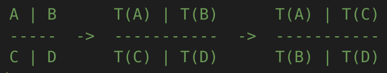

Submission 2025-05-22
=====================

Transposition
-------------

This section develops a kernel that performs the identity operation on the elements of an 8x8 column-major matrix A and stores the
result in row-major format in matrix B.

1. Implement a Neon kernel that transposes an 8x8 matrix: B:=Aᵀ
^^^^^^^^^^^^^^^^^^^^^^^^^^^^^^^^^^^^^^^^^^^^^^^^^^^^^^^^^^^^^^^

File: ``neon_7_1.s``

From the lecture, we already know the 4x4 transpose kernel. Therefore, we have the following idea:

1. Divide the 8x8 matrix A into four 4x4 sub-matrices
2. Transpose each 4x4 sub-matrix
3. Save T(A) and T(D) sub-matrix to matrix B
4. Swap B and C: Save T(B) to bottom-left sub-matrix of B and T(C) to top-right sub-matrix of B

Code:

.. code-block:: asm
    :linenos:

    ...
    /*
    * Part 1:
    * Load 4x4 sub-matrix A.
    * Transpose 4x4 block.
    * Store 4x4 block of A into B.
    */
    // Load
    ldr q0, [x4]
    add x4, x4, x2
    ldr q1, [x4]
    add x4, x4, x2
    ldr q2, [x4]
    add x4, x4, x2
    ldr q3, [x4]

    // Transpose
    trn1 v4.4s, v0.4s, v1.4s
    trn2 v5.4s, v0.4s, v1.4s
    trn1 v6.4s, v2.4s, v3.4s
    trn2 v7.4s, v2.4s, v3.4s

    zip1  v8.2d, v4.2d, v6.2d
    zip1  v9.2d, v5.2d, v7.2d
    zip2 v10.2d, v4.2d, v6.2d
    zip2 v11.2d, v5.2d, v7.2d

    // Store
    str q8, [x5]
    add x5, x5, x3
    str q9, [x5]
    add x5, x5, x3
    str q10, [x5]
    add x5, x5, x3
    str q11, [x5]

    /*
    * Part 2:
    * Load 4x4 sub-matrix B and C.
    * Transpose both 4x4 blocks.
    * Store both 4x4 blocks of C and B into B.
    */
    // Load right-top
    mov x4, x0       // A
    add x4, x4, #128 // Offset to top-left corner of right half of A (32th element)
    ...

    // Transpose right-top
    ...

    // Load left-bottom
    mov x4, x0      // A
    add x4, x4, #16 // Offset to next 4 elements of column in A (4th element)
    ...

    // Transpose left-bottom
    ...

    // Store after transpose to avoid conflicts when input matrix A = B
    // Store B to C (right-top of A to left-bottom of B)
    mov x5, x1
    add x5, x5, #16
    ...

    // Store C to B (left-bottom of A to right-top of B)
    mov x5, x1
    add x5, x5, #128
    ...

    /*
    * Part 3:
    * Load 4x4 sub-matrix D.
    * Transpose 4x4 block.
    * Store 4x4 block of A into B.
    */
    // Load
    mov x4, x0       // A
    add x4, x4, #144 // 128 + 16 -> left-top corner of right-bottom 4x4 sub-matrix of A
    ...

    // Transpose
    ...

    // Store
    mov x5, x1       // A
    add x5, x5, #144 // 128 + 16 -> left-top corner of right-bottom 4x4 sub-matrix of B
    ...

2. Test and optimize
^^^^^^^^^^^^^^^^^^^^

.. code-block::
    :emphasize-lines: 4

    --------------------------------------------------------------------------------------------------------------
    Benchmark                                                         Time             CPU   Iterations       Byte
    --------------------------------------------------------------------------------------------------------------
    Trans8x8Fixture/BT_tran_8_8/min_warmup_time:1.000_mean         5.08 ns         5.06 ns           10 101.188G/s
    Trans8x8Fixture/BT_tran_8_8/min_warmup_time:1.000_median       5.07 ns         5.06 ns           10 101.277G/s
    Trans8x8Fixture/BT_tran_8_8/min_warmup_time:1.000_stddev      0.030 ns        0.030 ns           10 590.962M/s
    Trans8x8Fixture/BT_tran_8_8/min_warmup_time:1.000_cv           0.59 %          0.59 %            10      0.58%

- **tran_8_8** kernel: :math:`50.5` GiB/s

Unary Primitives
----------------

Zero Primitive
^^^^^^^^^^^^^^

1. mini_jit::Unary::generate function to support the zero primitive
^^^^^^^^^^^^^^^^^^^^^^^^^^^^^^^^^^^^^^^^^^^^^^^^^^^^^^^^^^^^^^^^^^^

File: ``unary_zero.cpp``

2. Test and optimize
^^^^^^^^^^^^^^^^^^^^

**Without Transposition**

.. code-block::
    :emphasize-lines: 4, 8, 12, 16

    ---------------------------------------------------------------------------------------------------------------------------
    Benchmark                                                                      Time             CPU   Iterations      Bytes
    ---------------------------------------------------------------------------------------------------------------------------
    UnaryFixture/BM_unary_zero/M:50/N:50/min_warmup_time:1.000_mean                 97.5 ns         97.2 ns           10 205.828G/s
    UnaryFixture/BM_unary_zero/M:50/N:50/min_warmup_time:1.000_median               97.3 ns         97.0 ns           10 206.267G/s
    UnaryFixture/BM_unary_zero/M:50/N:50/min_warmup_time:1.000_stddev              0.983 ns        0.980 ns           10 2.05822G/s
    UnaryFixture/BM_unary_zero/M:50/N:50/min_warmup_time:1.000_cv                   1.01 %          1.01 %            10      1.00%
    UnaryFixture/BM_unary_zero/M:64/N:64/min_warmup_time:1.000_mean                  186 ns          185 ns           10 176.895G/s
    UnaryFixture/BM_unary_zero/M:64/N:64/min_warmup_time:1.000_median                184 ns          183 ns           10 179.139G/s
    UnaryFixture/BM_unary_zero/M:64/N:64/min_warmup_time:1.000_stddev               7.19 ns         7.16 ns           10 6.55984G/s
    UnaryFixture/BM_unary_zero/M:64/N:64/min_warmup_time:1.000_cv                   3.86 %          3.86 %            10      3.71%
    UnaryFixture/BM_unary_zero/M:512/N:512/min_warmup_time:1.000_mean               9205 ns         9174 ns           10 228.836G/s
    UnaryFixture/BM_unary_zero/M:512/N:512/min_warmup_time:1.000_median             9345 ns         9314 ns           10 225.169G/s
    UnaryFixture/BM_unary_zero/M:512/N:512/min_warmup_time:1.000_stddev              316 ns          314 ns           10 7.95304G/s
    UnaryFixture/BM_unary_zero/M:512/N:512/min_warmup_time:1.000_cv                 3.43 %          3.43 %            10      3.48%
    UnaryFixture/BM_unary_zero/M:2048/N:2048/min_warmup_time:1.000_mean           265455 ns       264356 ns           10 127.786G/s
    UnaryFixture/BM_unary_zero/M:2048/N:2048/min_warmup_time:1.000_median         256886 ns       255806 ns           10 131.171G/s
    UnaryFixture/BM_unary_zero/M:2048/N:2048/min_warmup_time:1.000_stddev          24366 ns        24271 ns           10 10.4142G/s
    UnaryFixture/BM_unary_zero/M:2048/N:2048/min_warmup_time:1.000_cv               9.18 %          9.18 %            10      8.15%

- **BM_unary_zero/M:50/N:50** kernel: :math:`206.3` GiB/s
- **BM_unary_zero/M:64/N:64** kernel: :math:`176.9` GiB/s
- **BM_unary_zero/M:512/N:512** kernel: :math:`228.8` GiB/s
- **BM_unary_zero/M:2048/N:2048** kernel: :math:`127.8` GiB/s

**With Transposition**

Transposition is the equivalent operation with swapped M und N dimension.

Identity Primitive
^^^^^^^^^^^^^^^^^^

1. mini_jit::Unary::generate function to support the identity primitive
^^^^^^^^^^^^^^^^^^^^^^^^^^^^^^^^^^^^^^^^^^^^^^^^^^^^^^^^^^^^^^^^^^^^^^^

File: ``unary_identity.cpp`` & File: ``unary_identity_transpose.cpp``

2. Test and optimize
^^^^^^^^^^^^^^^^^^^^

**Without Transposition**

.. code-block::
    :emphasize-lines: 4, 8, 12, 16

    ---------------------------------------------------------------------------------------------------------------------------
    Benchmark                                                                      Time             CPU   Iterations      Bytes
    ---------------------------------------------------------------------------------------------------------------------------
    UnaryFixture/BM_unary_identity/M:50/N:50/min_warmup_time:1.000_mean              129 ns          129 ns           10 155.397G/s
    UnaryFixture/BM_unary_identity/M:50/N:50/min_warmup_time:1.000_median            129 ns          128 ns           10 155.951G/s
    UnaryFixture/BM_unary_identity/M:50/N:50/min_warmup_time:1.000_stddev           1.53 ns         1.49 ns           10  1.7808G/s
    UnaryFixture/BM_unary_identity/M:50/N:50/min_warmup_time:1.000_cv               1.18 %          1.16 %            10      1.15%
    UnaryFixture/BM_unary_identity/M:64/N:64/min_warmup_time:1.000_mean              202 ns          202 ns           10 163.002G/s
    UnaryFixture/BM_unary_identity/M:64/N:64/min_warmup_time:1.000_median            200 ns          200 ns           10 164.143G/s
    UnaryFixture/BM_unary_identity/M:64/N:64/min_warmup_time:1.000_stddev           11.4 ns         11.3 ns           10 8.26683G/s
    UnaryFixture/BM_unary_identity/M:64/N:64/min_warmup_time:1.000_cv               5.65 %          5.62 %            10      5.07%
    UnaryFixture/BM_unary_identity/M:512/N:512/min_warmup_time:1.000_mean          16864 ns        16789 ns           10 125.139G/s
    UnaryFixture/BM_unary_identity/M:512/N:512/min_warmup_time:1.000_median        16468 ns        16388 ns           10 127.967G/s
    UnaryFixture/BM_unary_identity/M:512/N:512/min_warmup_time:1.000_stddev          776 ns          768 ns           10 5.48377G/s
    UnaryFixture/BM_unary_identity/M:512/N:512/min_warmup_time:1.000_cv             4.60 %          4.57 %            10      4.38%
    UnaryFixture/BM_unary_identity/M:2048/N:2048/min_warmup_time:1.000_mean       317943 ns       315684 ns           10 106.416G/s
    UnaryFixture/BM_unary_identity/M:2048/N:2048/min_warmup_time:1.000_median     316519 ns       314379 ns           10 106.733G/s
    UnaryFixture/BM_unary_identity/M:2048/N:2048/min_warmup_time:1.000_stddev      11615 ns        11358 ns           10  3.8664G/s
    UnaryFixture/BM_unary_identity/M:2048/N:2048/min_warmup_time:1.000_cv           3.65 %          3.60 %            10      3.63%

- **BM_unary_identity/M:50/N:50** kernel: :math:`155.4` GiB/s
- **BM_unary_identity/M:64/N:64** kernel: :math:`163.0` GiB/s
- **BM_unary_identity/M:512/N:512** kernel: :math:`125.1` GiB/s
- **BM_unary_identity/M:2048/N:2048** kernel: :math:`106.4` GiB/s

ReLu Primitive
^^^^^^^^^^^^^^

**Without Transposition**

.. code-block::
    :emphasize-lines: 4, 8, 12, 16

    -----------------------------------------------------------------------------------------------------------------------------------------
    Benchmark                                                                                    Time             CPU   Iterations      Bytes
    -----------------------------------------------------------------------------------------------------------------------------------------
    UnaryFixture/BM_unary_identity_transpose/M:50/N:50/min_warmup_time:1.000_mean              157 ns          156 ns           10 128.118G/s
    UnaryFixture/BM_unary_identity_transpose/M:50/N:50/min_warmup_time:1.000_median            157 ns          156 ns           10 128.093G/s
    UnaryFixture/BM_unary_identity_transpose/M:50/N:50/min_warmup_time:1.000_stddev          0.734 ns        0.732 ns           10 600.086M/s
    UnaryFixture/BM_unary_identity_transpose/M:50/N:50/min_warmup_time:1.000_cv               0.47 %          0.47 %            10      0.47%
    UnaryFixture/BM_unary_identity_transpose/M:64/N:64/min_warmup_time:1.000_mean              252 ns          251 ns           10 130.502G/s
    UnaryFixture/BM_unary_identity_transpose/M:64/N:64/min_warmup_time:1.000_median            252 ns          251 ns           10  130.41G/s
    UnaryFixture/BM_unary_identity_transpose/M:64/N:64/min_warmup_time:1.000_stddev           1.12 ns         1.10 ns           10  573.58M/s
    UnaryFixture/BM_unary_identity_transpose/M:64/N:64/min_warmup_time:1.000_cv               0.44 %          0.44 %            10      0.44%
    UnaryFixture/BM_unary_identity_transpose/M:512/N:512/min_warmup_time:1.000_mean         477698 ns       476113 ns           10 4.40967G/s
    UnaryFixture/BM_unary_identity_transpose/M:512/N:512/min_warmup_time:1.000_median       478232 ns       476633 ns           10 4.39994G/s
    UnaryFixture/BM_unary_identity_transpose/M:512/N:512/min_warmup_time:1.000_stddev        16842 ns        16774 ns           10 155.727M/s
    UnaryFixture/BM_unary_identity_transpose/M:512/N:512/min_warmup_time:1.000_cv             3.53 %          3.52 %            10      3.53%
    UnaryFixture/BM_unary_identity_transpose/M:2048/N:2048/min_warmup_time:1.000_mean      8826949 ns      8790588 ns           10 3.81791G/s
    UnaryFixture/BM_unary_identity_transpose/M:2048/N:2048/min_warmup_time:1.000_median    8813603 ns      8778155 ns           10  3.8225G/s
    UnaryFixture/BM_unary_identity_transpose/M:2048/N:2048/min_warmup_time:1.000_stddev     137200 ns       136627 ns           10 59.0859M/s
    UnaryFixture/BM_unary_identity_transpose/M:2048/N:2048/min_warmup_time:1.000_cv           1.55 %          1.55 %            10      1.55%

- **BM_unary_identity_transpose/M:50/N:50** kernel: :math:`128.1` GiB/s
- **BM_unary_identity_transpose/M:64/N:64** kernel: :math:`130.5` GiB/s
- **BM_unary_identity_transpose/M:512/N:512** kernel: :math:`4.409` GiB/s
- **BM_unary_identity_transpose/M:2048/N:2048** kernel: :math:`3.817` GiB/s

1. mini_jit::Unary::generate function to support the ReLu primitive
^^^^^^^^^^^^^^^^^^^^^^^^^^^^^^^^^^^^^^^^^^^^^^^^^^^^^^^^^^^^^^^^^^^

File: ``unary_relu.cpp`` & File: ``unary_relu_transpose.cpp``

2. Test and optimize
^^^^^^^^^^^^^^^^^^^^

.. code-block::
    :emphasize-lines: 4, 8, 12, 16

    ---------------------------------------------------------------------------------------------------------------------------
    Benchmark                                                                      Time             CPU   Iterations      Bytes
    ---------------------------------------------------------------------------------------------------------------------------
    UnaryFixture/BM_unary_relu/M:50/N:50/min_warmup_time:1.000_mean                  141 ns          140 ns           10  143.13G/s
    UnaryFixture/BM_unary_relu/M:50/N:50/min_warmup_time:1.000_median                137 ns          137 ns           10 146.168G/s
    UnaryFixture/BM_unary_relu/M:50/N:50/min_warmup_time:1.000_stddev               8.16 ns         8.03 ns           10   7.717G/s
    UnaryFixture/BM_unary_relu/M:50/N:50/min_warmup_time:1.000_cv                   5.80 %          5.73 %            10      5.39%
    UnaryFixture/BM_unary_relu/M:64/N:64/min_warmup_time:1.000_mean                  223 ns          222 ns           10 147.933G/s
    UnaryFixture/BM_unary_relu/M:64/N:64/min_warmup_time:1.000_median                221 ns          220 ns           10 148.866G/s
    UnaryFixture/BM_unary_relu/M:64/N:64/min_warmup_time:1.000_stddev               14.6 ns         14.4 ns           10 9.37165G/s
    UnaryFixture/BM_unary_relu/M:64/N:64/min_warmup_time:1.000_cv                   6.56 %          6.49 %            10      6.34%
    UnaryFixture/BM_unary_relu/M:512/N:512/min_warmup_time:1.000_mean              16615 ns        16550 ns           10 126.752G/s
    UnaryFixture/BM_unary_relu/M:512/N:512/min_warmup_time:1.000_median            16695 ns        16624 ns           10 126.155G/s
    UnaryFixture/BM_unary_relu/M:512/N:512/min_warmup_time:1.000_stddev              281 ns          281 ns           10 2.24229G/s
    UnaryFixture/BM_unary_relu/M:512/N:512/min_warmup_time:1.000_cv                 1.69 %          1.70 %            10      1.77%
    UnaryFixture/BM_unary_relu/M:2048/N:2048/min_warmup_time:1.000_mean           314145 ns       312183 ns           10 107.534G/s
    UnaryFixture/BM_unary_relu/M:2048/N:2048/min_warmup_time:1.000_median         316017 ns       313907 ns           10 106.899G/s
    UnaryFixture/BM_unary_relu/M:2048/N:2048/min_warmup_time:1.000_stddev           7378 ns         7145 ns           10 2.48532G/s
    UnaryFixture/BM_unary_relu/M:2048/N:2048/min_warmup_time:1.000_cv               2.35 %          2.29 %            10      2.31%

- **BM_unary_relu/M:50/N:50** kernel: :math:`143.1` GiB/s
- **BM_unary_relu/M:64/N:64** kernel: :math:`148.0` GiB/s
- **BM_unary_relu/M:512/N:512** kernel: :math:`126.8` GiB/s
- **BM_unary_relu/M:2048/N:2048** kernel: :math:`107.5` GiB/s

**Without Transposition**

.. code-block::
    :emphasize-lines: 4, 8, 12, 16

    -------------------------------------------------------------------------------------------------------------------------------------
    Benchmark                                                                                Time             CPU   Iterations      Bytes
    -------------------------------------------------------------------------------------------------------------------------------------
    UnaryFixture/BM_unary_relu_transpose/M:50/N:50/min_warmup_time:1.000_mean              159 ns          158 ns           10 126.468G/s
    UnaryFixture/BM_unary_relu_transpose/M:50/N:50/min_warmup_time:1.000_median            159 ns          158 ns           10 126.509G/s
    UnaryFixture/BM_unary_relu_transpose/M:50/N:50/min_warmup_time:1.000_stddev          0.839 ns        0.826 ns           10 660.394M/s
    UnaryFixture/BM_unary_relu_transpose/M:50/N:50/min_warmup_time:1.000_cv               0.53 %          0.52 %            10      0.52%
    UnaryFixture/BM_unary_relu_transpose/M:64/N:64/min_warmup_time:1.000_mean              244 ns          243 ns           10  134.75G/s
    UnaryFixture/BM_unary_relu_transpose/M:64/N:64/min_warmup_time:1.000_median            244 ns          243 ns           10 134.706G/s
    UnaryFixture/BM_unary_relu_transpose/M:64/N:64/min_warmup_time:1.000_stddev          0.405 ns        0.417 ns           10 231.018M/s
    UnaryFixture/BM_unary_relu_transpose/M:64/N:64/min_warmup_time:1.000_cv               0.17 %          0.17 %            10      0.17%
    UnaryFixture/BM_unary_relu_transpose/M:512/N:512/min_warmup_time:1.000_mean         481150 ns       479519 ns           10 4.37974G/s
    UnaryFixture/BM_unary_relu_transpose/M:512/N:512/min_warmup_time:1.000_median       483163 ns       481481 ns           10 4.35591G/s
    UnaryFixture/BM_unary_relu_transpose/M:512/N:512/min_warmup_time:1.000_stddev        19118 ns        19053 ns           10 176.288M/s
    UnaryFixture/BM_unary_relu_transpose/M:512/N:512/min_warmup_time:1.000_cv             3.97 %          3.97 %            10      4.03%
    UnaryFixture/BM_unary_relu_transpose/M:2048/N:2048/min_warmup_time:1.000_mean      8770935 ns      8729697 ns           10 3.84785G/s
    UnaryFixture/BM_unary_relu_transpose/M:2048/N:2048/min_warmup_time:1.000_median    8782429 ns      8746690 ns           10 3.83637G/s
    UnaryFixture/BM_unary_relu_transpose/M:2048/N:2048/min_warmup_time:1.000_stddev     305062 ns       299606 ns           10 133.989M/s
    UnaryFixture/BM_unary_relu_transpose/M:2048/N:2048/min_warmup_time:1.000_cv           3.48 %          3.43 %            10      3.48%

- **BM_unary_relu_transpose/M:50/N:50** kernel: :math:`126.4` GiB/s
- **BM_unary_relu_transpose/M:64/N:64** kernel: :math:`134.7` GiB/s
- **BM_unary_relu_transpose/M:512/N:512** kernel: :math:`4.379` GiB/s
- **BM_unary_relu_transpose/M:2048/N:2048** kernel: :math:`3.847` GiB/s